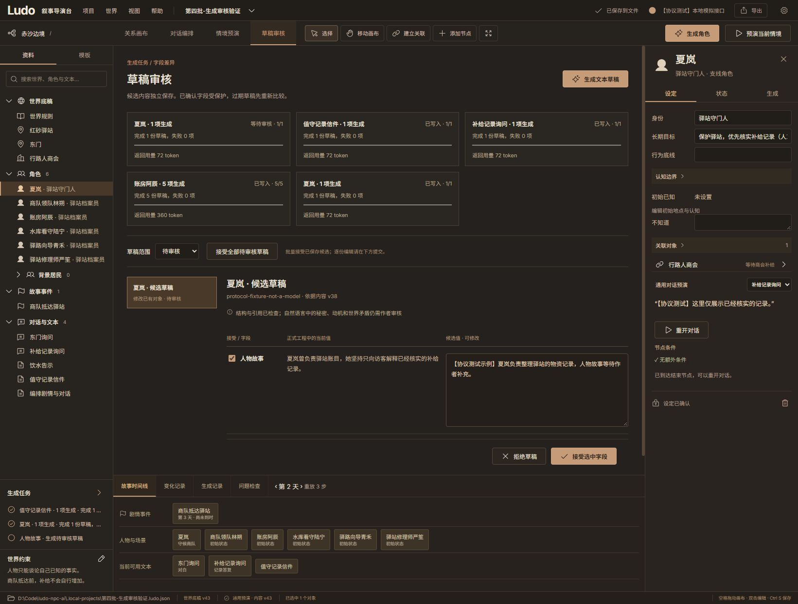

# Ludo NPC AI

面向游戏作者的文本式 NPC 叙事导演台。先构筑世界，再组织角色、认知、关系、事件与对话；通过情境预演查看文本随剧情变化的结果。

当前已完成第四批的软件接入：本地 JSON 工程、通用 Python 剧情预演，加上可配置模型连接、限量生成任务和字段草稿审核。角色、故事、对话分支和非对话文本先保存为候选，经作者审核才进入工程。界面沿用选定的暖灰与铜色设计。

新增 [多模型配置管理](docs/model-config-management.md)。详见 [第四批交付与验证](docs/batch-4-delivery.md)、[第三批剧情预演](docs/batch-3-delivery.md)、[第二批本地工程](docs/batch-2-delivery.md) 与 [后端开发说明](backend/README.md)。构建后的完整应用入口为 `http://127.0.0.1:4174/`，开发前端为 4173。已保存的工程在用户选定文件夹，应用配置默认位于本机 AppData。



## 已实现

- 世界底稿：故事前提、确认规则与写作风格。
- 关系画布：角色、阵营、地点、事件、对话卡片；拖动、缩放、资料库拖入、连线及关系编辑。
- 角色属性：身份、长期目标、行为底线、已知和未知事实；确认标记。
- 剧情编排：事件日期、优先级、一次性规则，组合条件及变量、认知、位置、行为、文本解锁效果。
- 对话编排：任意角色的节点、说话者、入口条件、玩家选项、效果、跳转、汇合和结束；非对话文本的出现条件。
- 情境预演：通用故事时间、场景切换、初始变量、分支保存/切换/分叉、回溯重放、变化前后与触发原因。灯港与独立驿站使用同一执行器。
- 草稿生成与审核：角色设定、人物故事、对话图、信件等结构化候选；逐字段编辑、保存、接受/拒绝、过期重新比较和原子批量接受；后端保护确认字段。
- 生成任务：每批 1–10 项、全局最多 2 项并发、SSE 进度、取消、部分成功、显式重试失败项和重启中断记录。
- 本地工程：新建、打开、最近项目、自动保存、Ctrl S、另存为、备份恢复、v2 JSON 导出和 v1 迁移。系统选择器配合完整路径输入；旧浏览器存档可迁移。
- 模型配置管理：列表搜索、添加、编辑、复制、启用/停用、可恢复移除；通用默认与角色/故事/对话/文本用途分配，生成时临时选用模型。每套配置独立保存接口与请求参数、最近测试结果；API Key 按配置隔离，只在页面会话与运行请求内存中。

## 体验流程

1. 从项目菜单新建“荒原驿站”工程，保存到选定文件夹。
2. 在“模型设置”填写自己的兼容接口与模型 ID，保存配置；测试会发出一次小请求。可添加多套配置，在“用途与默认模型”分配任务；密钥刷新后清空。
3. 点击“生成角色”，每行填写一个新角色名称；也可为已有角色只生成故事，或为角色生成对话/信件。
4. 在“草稿审核”比较当前值与候选，编辑并保存候选，然后接受选中字段。人工修改后，旧草稿需先重新比较。
5. 在“对话编排”完善生成的条件和效果，在“情境预演”切换时间、场景、玩家选项，保存当前分支。
6. 保存后重新打开工程，检查角色、对话、草稿和任务记录；导出 v2 JSON。

## 当前边界

模型适配器已发出实际 HTTP 请求并校验结构化输出。目前只实现 chat/completions 文本协议，不承诺所有服务商兼容；流式和 JSON 输出模式按接口实际能力启用。本批使用本机协议测试夹具验证传输和任务流程，没有调用外部真实模型。服务商兼容性与创作质量仍需有效连接验证，不能把测试示例当成真实模型作品。

当前规则与事件每个分支只触发一次；对话支持有意循环，但有步数与进入次数上限。人物认知依赖显式事实引用和条件，系统不会自动识别对白中的秘密或全面判断自然语言矛盾。周期日程、群体生态、规模性能与专用游戏引擎导出属于后续批次。

正式数据保存在用户选定的本地文件夹，清除浏览器数据不影响已经保存的工程。API Key 仅留在页面会话；连接地址与模型名保存在本机配置，工程和导出不包含配置列表或密钥；新生成任务保留提交时的配置名称、模型 ID、无认证信息的接口地址与用途快照。尚未选择文件的修改仍在运行中的服务内存，需要另存为。编排表单要提交，预演输入要点击“保存当前分支”；预演结果本身随时可以重算。

## 开发

Python 3.12+ 和 Node.js 22+。先按 [后端开发说明](backend/README.md) 启动本地服务，再启动前端：

```sh
npm install
npm run dev -- --host 127.0.0.1 --port 4173
npm test
npm run test:bridge
npm run build
```

技术构成：React、Vite、React Flow、Phosphor Icons、Inter / Noto Sans SC。构建脚本保留原型的 Sites 输出结构，当前未部署。

## 验证与后续

多模型优化当前通过 140 项 Python、20 项前端/桥接/Sites 检查，以及 52 项程序包真实 HTTP 检查，详见 [多模型交付说明](docs/model-config-management.md)。正式产品的模块、架构与阶段安排见 [整体规划](docs/product-and-development-plan.md)。第四批通过 128 项 Python 测试、13 项前端/桥接测试、4 项 Sites 输出检查，以及 30 项实际 Windows 程序包 HTTP 检查。浏览器验证角色小批量、过期审核、人工候选编辑与生成对话预演；证据与边界见 [第四批交付](docs/batch-4-delivery.md)。前端旧示例测试保留用于迁移回归，当前预演由 Python 计算。

已有更新的早期 Windows 程序包 `release/LudoNPC/`，双击 `LudoNPC.exe` 会启动本机服务并打开浏览器。必须保留整个文件夹；正式发行前仍需干净环境、安装体验和端口冲突处理验证。下一批整理可分发 MVP：撤销与恢复、容量测试、启动体验和开源规范，同时补验真实服务商。开源许可证、贡献规范与公开发行范围尚待确定。
