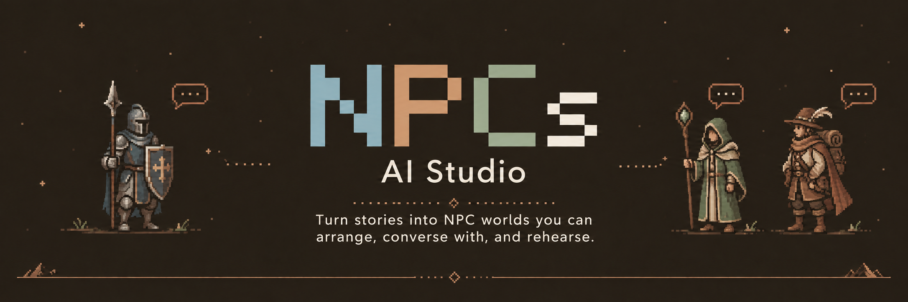
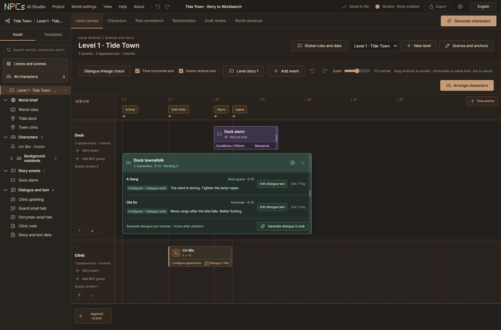
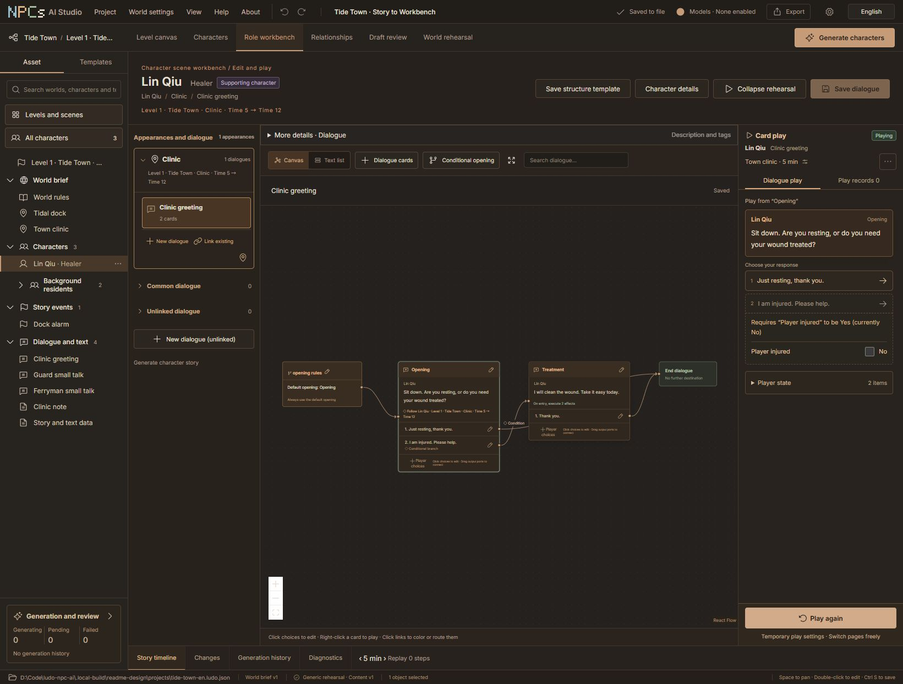
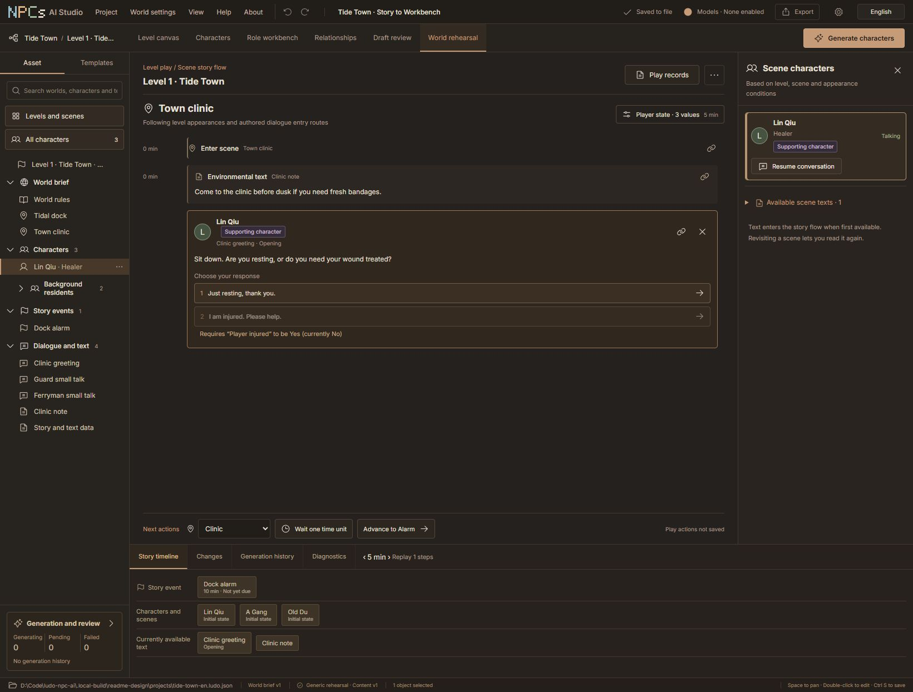

<p align="center">
  
</p>

<h3 align="center">Build the world. Meet the cast. Play the conversation.</h3>

<p align="center">
  A local narrative workbench for NPCs, branching dialogue and scene direction.<br>
  Bring your own AI. Keep the author's final say.
</p>

<p align="center">
  <a href="#status"></a>
  <a href="#local-data"></a>
  <a href="#ai-skills"></a>
  <a href="#workflow"></a>
</p>

<p align="center">
  <b>English</b> · <a href="README.zh-CN.md">简体中文</a><br><br>
  <a href="#overview">Overview</a> · <a href="#workbench">Workbench</a> · <a href="#ai-skills">AI Skills</a> · <a href="#quick-start">Quick start</a> · <a href="#example">Example</a> · <a href="#local-data">Your data</a> · <a href="#documentation">Docs</a>
</p>

---

<a id="overview"></a>
## A story deserves more than a wall of text

**NPCs AI Studio turns a story outline into a visible authoring workspace.** Establish the world's facts, build a cast, place characters in scenes, connect dialogue choices and rehearse what the player encounters. Use it for RPG quests, interactive fiction, narrative prototypes and NPC dialogue planning.

Your own AI can prepare the material through the bilingual Skills. The built-in model connection can generate focused candidates. Both workflows leave you in control of the final text.

> **World brief → Characters → Scenes & appearances → Dialogue & events → Review → Rehearsal → Handoff**

| Workspace | What you can create |
| :--- | :--- |
| **🌍 World & levels** | Shared world facts and writing style, with region details and local story premises kept in each level. |
| **👥 Cast & relationships** | Key, supporting and background characters; editable profiles, knowledge, groups, quick notes and relationship connections. |
| **🎬 Scene direction** | Scene tracks and time/plot-phase anchors. Place the same character several times without copying their profile. |
| **💬 Dialogue cards** | NPC lines, player choices, conditions, effects, branches, shared destinations and endings in one connected canvas. |
| **✦ AI & review** | Character, story, dialogue and text candidates; readable review cards, field differences and protected author facts. |
| **▶ Play & delivery** | Temporary dialogue play, scene story flows, local records, reusable templates and JSON / Markdown / CSV exports. |

<a id="workbench"></a>
## Inside the workbench

### 01 · Direct the scene

Arrange appearances along scene tracks and story time. NPC groups collect background characters while keeping each member's profile and dialogue independently editable. Muted green groups, plum events and copper character controls make the canvas easier to read.

<p align="center"></p>
<p align="center"><sub>One level · two scenes · three characters · a once-only event. Actual application capture.</sub></p>

### 02 · Write the branch, then try it

Connect dialogue cards and player choices. Put availability conditions beside the response that needs them, and see why a choice is unavailable. In temporary card play, adjust the player's test state and continue from the current card.

<p align="center"></p>
<p align="center"><sub>“I am injured. Please help.” becomes available when the test player is injured.</sub></p>

### 03 · Walk through the story

Global rehearsal presents a scene story flow: enter a location, read environmental text, approach an available character and choose a response. Advance story time and inspect the events, character state and available text on the bottom timeline. Source links take you back to the authoring material.

<p align="center"></p>
<p align="center"><sub>Saved content and authored rules drive rehearsal; it does not ask a model to invent the next line.</sub></p>

<a id="ai-skills"></a>
## Your AI, working alongside your workbench

**Use the AI assistant you already work with.** The Skills explain how to translate prose into the tool's world, cast, scenes, relationships, appearances, events and dialogue structures.

<p align="center">
  <a href="skills/npcs-ai-studio-en/SKILL.md"><b>English Skill</b></a> &nbsp; · &nbsp;
  <a href="skills/npcs-ai-studio-zh/SKILL.md"><b>中文 Skill</b></a> &nbsp; · &nbsp;
  <a href="docs/skill-collaboration-guide.md">Collaboration guide</a>
</p>

| Start a new story | Improve an existing project |
| :--- | :--- |
| Give your AI a story or outline. It prepares a storyboard and compiles a **separate new project file** with basic canvas layouts. | Your AI reads a fresh project snapshot and prepares **pending entity drafts**. You compare, edit and adopt them in Draft Review. |
| Open the file and adjust the scenes, cast and dialogue. | Existing formal content stays in place until you adopt a candidate. Conflicting revisions require a fresh comparison. |

Add **one** complete Skill folder to your AI tool's supported Skill location, or provide its `SKILL.md` and referenced resources as context. Choose the language you prefer; both packs have equivalent capabilities and include a bridge, Schema and runnable examples.

Try a prompt like:

```text
Use the NPCs AI Studio Skill to turn this story into a new local project.
Start with one level, two scenes, a healer and a two-person background NPC group.
Give each NPC their own dialogue. Add a treatment choice gated by player injury.
Validate the project and rehearse both injured and healthy paths.
Explain your assumptions and tell me where to open the result.
```

An AI tool with local execution can use the bridge to validate, import and submit drafts. A cloud chat without access to your computer can prepare files for handoff; it cannot directly operate your local workbench. The bridge itself makes no model requests and does not need a platform API key. Supported collaboration Windows builds offer `NPCsAIStudio.exe --skill-bridge`; the standalone helper uses Python 3.10+.

<a id="workflow"></a>
## Generate less guesswork, review more deliberately

Built-in generation uses your chosen chat/completions-compatible connection. Enable multiple model profiles, assign purpose defaults, or choose a model for a specific request.

- **Choose the scope first.** Generate a character profile, that character's story, a dialogue graph or a piece of environmental text.
- **Make quantity explicit.** NPC group generation distinguishes the number of people, dialogue cards per NPC and text length per card. Each request item targets one NPC.
- **Keep the successful work.** Batches contain 1–10 items with at most 2 concurrent provider calls. Cancel remaining work or retry failed items without rerunning successful ones.
- **Review before adoption.** Open a candidate card, read the text, inspect field differences and adopt only what you want. Confirmed fields are protected from model overwrite.

Scene NPC groups create actual character profiles and appearances. The advanced anonymous environmental text pool creates text only. Multiple enabled models provide a choice of connections; they do not automatically collaborate with each other.

<a id="quick-start"></a>
## Get started

### Run from source

Requirements: **Node.js 22+** and **Python 3.12+**. From the repository root:

```powershell
git clone https://github.com/koronto11/ludo-npc-ai.git
cd ludo-npc-ai
npm ci
npm run build
python -m venv backend/.venv
backend/.venv/Scripts/python.exe -m pip install -e './backend[dev,package]' -c backend/requirements-dev.lock
backend/.venv/Scripts/python.exe -m ludo_npc --open-browser
```

The service opens the local workbench after startup. Its default address is `http://127.0.0.1:4174/`; if the default port is occupied, it chooses an available port. Use the URL printed by the launcher. Projects and application settings use your user folders by default.

<details>
<summary><b>macOS / Linux source commands</b></summary>

After cloning the repository and running `npm ci` and `npm run build`:

```sh
python3 -m venv backend/.venv
backend/.venv/bin/python -m pip install -e './backend[dev,package]' -c backend/requirements-dev.lock
backend/.venv/bin/python -m ludo_npc --open-browser
```

These are source-run instructions. Windows packaging and encrypted credential remembering are separate platform features; macOS/Linux credentials currently stay in the session.

</details>

<details>
<summary><b>Windows folder preview package</b></summary>

When you have a built folder package, keep its whole directory and launch `NPCsAIStudio.exe`. It starts the same local service and opens the browser workbench. See the [Windows preview guide](docs/windows-preview-guide.md) for packaging and acceptance details. Clean-machine release acceptance and public distribution are still pending; this README does not link a public installer.

</details>

### Build your first playable slice

1. **Create a local project** and choose its parent folder. The tool creates a project folder with the same name.
2. **Write the world brief**: shared premise, confirmed rules and writing style. Add regional details in the level settings.
3. **Create characters and scenes**, then place appearances on the level canvas. Use an NPC group for a set of background residents.
4. **Write or generate dialogue.** For AI candidates, adopt the desired text in Draft Review before testing it.
5. **Try the choices** in the role workbench, then rehearse the scene flow globally.
6. **Save and hand off** a reopenable project, design notes or a dialogue table.

**No API key is required for manual authoring, local rehearsal or Skill bridge operations.** Configure a model and your own key only when using the workbench's remote generation or connection test. Those requests go to your selected provider.

<a id="example"></a>
## Try Tide Town

The screenshots come from the original bilingual Skill example: a player arrives at a windy dock, meets two townsfolk, visits a healer and can request treatment when injured. A dock alarm occurs at story minute 10. A clinic note supplies environmental text.

| Material | English | 中文 |
| :--- | :--- | :--- |
| Story source | [Read the story](skills/npcs-ai-studio-en/assets/story-source.md) | [阅读故事](skills/npcs-ai-studio-zh/assets/story-source.md) |
| Structured storyboard | [JSON example](skills/npcs-ai-studio-en/assets/storyboard-example.json) | [JSON 示例](skills/npcs-ai-studio-zh/assets/storyboard-example.json) |
| Local bridge | [Commands & formats](skills/npcs-ai-studio-en/references/local-bridge.md) | [命令与格式](skills/npcs-ai-studio-zh/references/local-bridge.md) |

With the workbench running at the address shown below, compile the English example from the repository root:

```powershell
backend/.venv/Scripts/python.exe skills/npcs-ai-studio-en/scripts/npc_studio_bridge.py --base-url http://127.0.0.1:4174 compile --input skills/npcs-ai-studio-en/assets/storyboard-example.json --output tide-town.ludo.json
```

Replace the URL with your actual local address when it differs. Compilation validates through the running service and refuses an existing output file. Use **Project → Open local project** to select the new file. This is an authored demonstration, not a showcase of real provider output.

<a id="local-data"></a>
## A local project you can keep

| Data | Where it lives |
| :--- | :--- |
| **Project content** | Your chosen project folder: world, characters, levels, scenes, dialogue, drafts, generation records and saved play records. |
| **Backups & exported files** | Beside the project in its folder. Full JSON backups can be reopened; Markdown design notes and UTF-8 CSV dialogue tables support handoff. |
| **Models & templates** | The local application data folder, shared across projects and separate from project backups. |
| **API keys** | On Windows, optionally remembered using current-user DPAPI in a separate credential file. Session-only mode and explicit clearing are available. Other systems currently use session-only input. |

Project exports, templates and Skills do not include stored model credentials. Changing a connection destination requires re-entering its key; copying a model profile does not copy the key. Editing and deterministic rehearsal work offline. Built-in remote generation sends its story context to the connection you choose.

The interface and help switch between **中文 / English**. This changes the UI language, not the project's story text or the model's output language.

<a id="documentation"></a>
## Find your next step

| I want to… | Read this |
| :--- | :--- |
| Learn the author workflow | [English user guide](docs/user-guide-en.md) · [中文使用手册](docs/user-guide-zh.md) |
| Work with my own AI | [Bilingual Skill collaboration guide](docs/skill-collaboration-guide.md) |
| Understand generation limits | [Scene generation quantity and length](docs/scene-generation-limits-delivery.md) |
| Understand drafts and recovery | [Draft inbox](docs/draft-inbox-delivery.md) · [Local project folders](docs/project-folder-delivery.md) |
| Develop or integrate | [Python service](backend/README.md) · [Architecture](docs/architecture.md) · [Project Schema](schemas/project-v2.schema.json) |
| Inspect delivery evidence | [Development history](docs/development-history.md) · [Capacity and packaging](docs/stability-capacity-package-delivery.md) |

<a id="status"></a>
## Preview status & next milestones

**Current mainline: 0.1.0 preview.** Authoring, local storage, draft review, model connection workflows, bilingual Skills and deterministic rehearsal are implemented. Provider compatibility and output quality depend on the selected service; protocol fixtures do not establish real-model quality acceptance.

Next milestones include clean Windows machine acceptance, release packaging and licensing decisions, broader real-provider verification, and dedicated engine handoff adapters. Current exports are JSON, Markdown and CSV. The workbench plans narrative text; it does not create 3D characters or run a game engine. Knowledge, conditions and effects are authored explicitly; natural-language secrets and contradictions still need the author's review.

Built with **React · Vite · React Flow · Python · FastAPI · Pydantic**, backed by local JSON files. For contributors, start with the [backend setup and checks](backend/README.md), [project plan](docs/product-and-development-plan.md) and [historical delivery notes](docs/development-history.md). Licensing and public release terms remain to be finalized.

---

<p align="center"><b>Give every NPC a place, a voice and a reason to be there.</b><br><sub>NPCs AI Studio · Story, cast, conversation.</sub></p>
