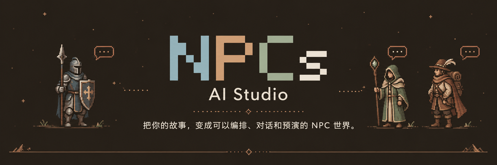
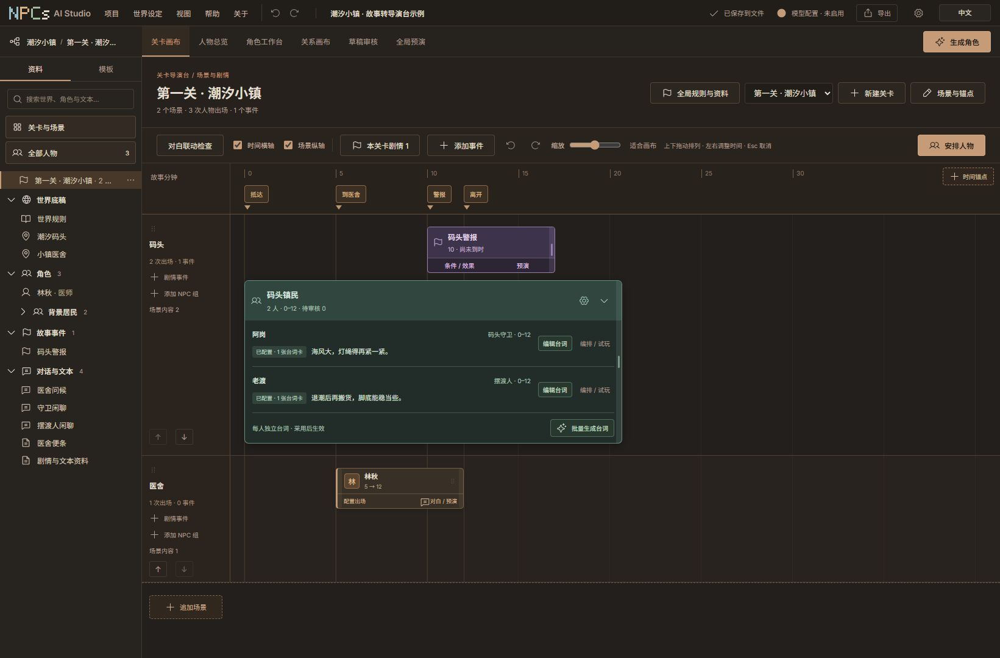
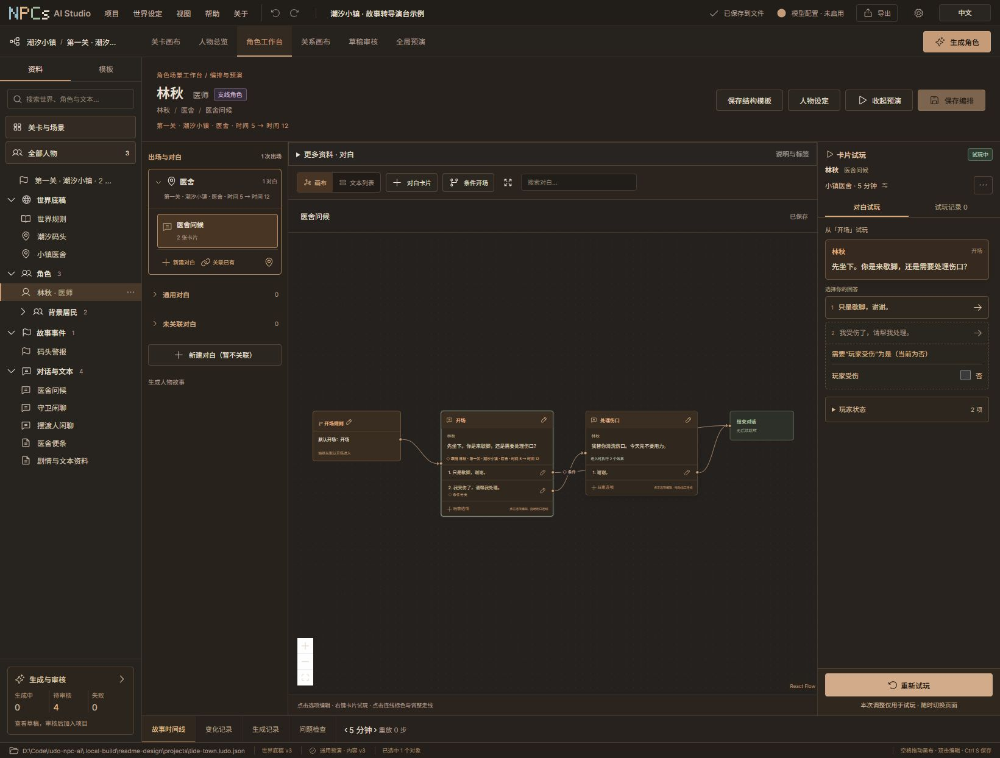
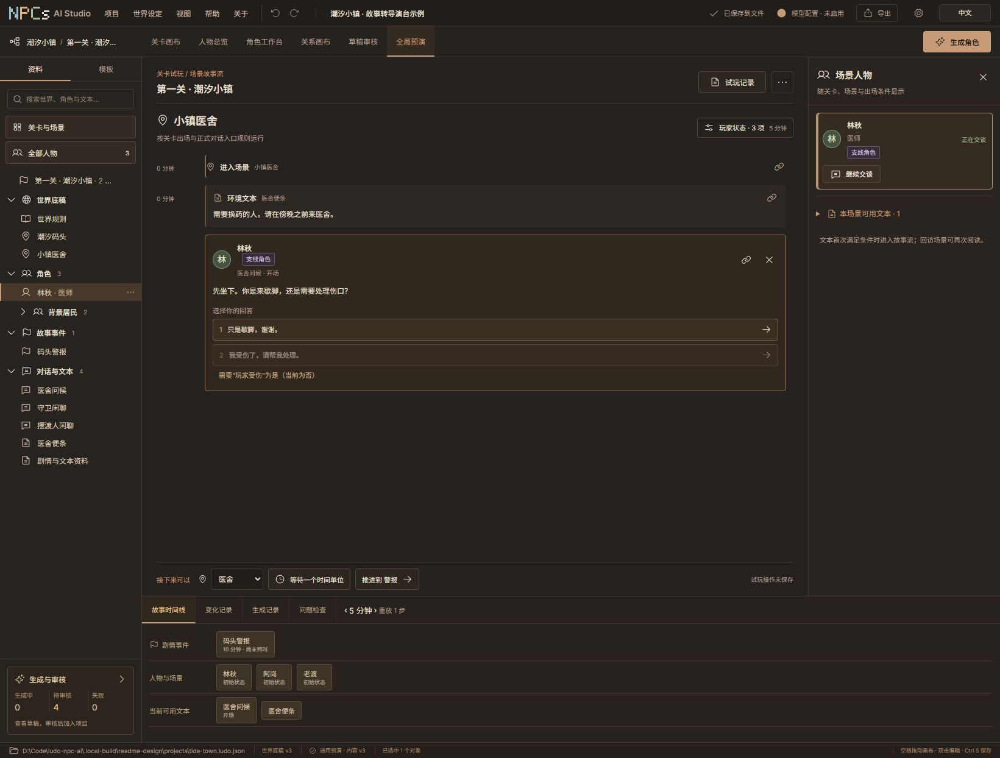
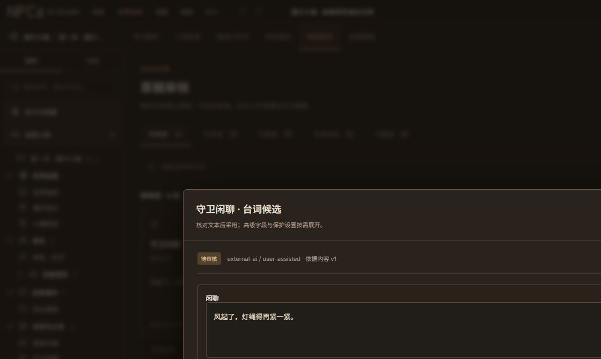

<p align="center">
  
</p>

<h3 align="center">构筑世界，安排人物，亲自走进对话。</h3>

<p align="center">
  面向 NPC、分支对白与场景编排的本地叙事工作台。<br>
  和你自己的 AI 一起创作，由你决定最后采用什么。
</p>

<p align="center">
  <a href="#status"></a>
  <a href="#local-data"></a>
  <a href="#ai-skills"></a>
  <a href="#workflow"></a>
</p>

<p align="center">
  <a href="README.md">English</a> · <b>简体中文</b><br><br>
  <a href="#overview">平台介绍</a> · <a href="#workbench">工作台展示</a> · <a href="#ai-skills">AI 协作</a> · <a href="#quick-start">快速开始</a> · <a href="#example">故事示例</a> · <a href="#local-data">数据保存</a> · <a href="#documentation">文档</a>
</p>

---

<a id="overview"></a>
## 让故事从文字，走到看得见的工作台

**NPCs AI Studio 将故事大纲整理为直观的创作空间。** 先确定世界事实，再创建人物、安排场景出场、连接对白选项，最后模拟玩家会遇见什么。适合 RPG 任务、互动小说、叙事原型与 NPC 台词规划。

你的 AI 可以通过中英文 Skill 协助整理故事，平台内的模型连接也可以生成指定内容的候选稿。两条路径都保留作者对最终文本的决定权。

> **世界底稿 → 人物设定 → 场景与出场 → 对白与事件 → 草稿审核 → 实际预演 → 内容交付**

| 工作区 | 可以创作什么 |
| :--- | :--- |
| **🌍 世界与关卡** | 整个项目共享的世界事实与写作风格；区域说明和局部剧情放在各自关卡中。 |
| **👥 人物与关系** | 关键、支线和背景角色；可编辑设定、认知、分组、快速备注与关系连线。 |
| **🎬 场景编排** | 场景轨道与时间 / 剧情阶段锚点。同一个人物可以多次出场，共用人物档案。 |
| **💬 对白卡片** | NPC 台词、玩家选项、条件、效果、分支、汇合和结束，集中在连线画布上。 |
| **✦ AI 与审核** | 人物、故事、对白与文本候选；卡片阅读、字段差异比较，以及作者确认字段保护。 |
| **▶ 预演与交付** | 临时对白试玩、场景故事流、本地记录、可复用模板，以及 JSON / Markdown / CSV 导出。 |

<a id="workbench"></a>
## 看看工作台如何运转

### 01 · 先把人物安排进场景

按场景和故事时间安排出场。背景 NPC 组将一组人物放在一起管理，每个成员仍有独立档案和对白，可分别微调。绿色 NPC 组、紫色事件和铜色人物控件让画布更容易辨认。

<p align="center"></p>
<p align="center"><sub>一个关卡 · 两个场景 · 三个人物 · 一次性剧情事件。截图来自实际应用。</sub></p>

### 02 · 写出分支，再亲自试一遍

连接对白卡片与玩家选项，把出现条件配置在相应回答上。不可选的回答会显示原因。临时卡片试玩可以调整玩家状态，并从当前对白继续，不必为了测试一个选项反复重新开场。

<p align="center"></p>
<p align="center"><sub>将试玩玩家设置为受伤后，“我受伤了，请帮我处理。”才可以选择。</sub></p>

### 03 · 沿着场景，走过完整故事流

全局预演将过程呈现为场景故事流：进入地点、阅读环境文本、接触当前可交谈的人物，再选择回答。推进故事时间，通过底部时间线查看事件、人物状态和当前可用文本；来源入口可以直接回到相应编排内容。

<p align="center"></p>
<p align="center"><sub>预演使用已保存的内容和作者配置的规则运行，不依赖模型临时续写。</sub></p>

<a id="ai-skills"></a>
## 让你自己的 AI，和这张工作台一起创作

**继续使用你熟悉的 AI 助手。** Skill 会告诉它如何将故事转换为平台中的世界、人物、场景、关系、出场、事件和对白结构。

<p align="center">
  <a href="skills/npcs-ai-studio-zh/SKILL.md"><b>中文 Skill</b></a> &nbsp; · &nbsp;
  <a href="skills/npcs-ai-studio-en/SKILL.md"><b>English Skill</b></a> &nbsp; · &nbsp;
  <a href="docs/skill-collaboration-guide.md">完整协作说明</a>
</p>

| 从新故事开始 | 协助已有项目 |
| :--- | :--- |
| 将故事或大纲交给 AI，它整理结构并编译为**独立的新工程文件**，同时提供基础画布布局。 | AI 读取最新项目快照，提交**待审核的对象草稿**，由你在草稿审核中比较、编辑和采用。 |
| 打开工程后继续调整人物、场景和对白。 | 采用候选前，正式内容保持原样；版本发生冲突时需要重新核对。 |

将**一份完整 Skill 文件夹**放入 AI 工具支持的 Skill 目录，或把 `SKILL.md` 及引用资源交给 AI 作为上下文。中英文任选其一，两份提供等价能力，包含协作桥接脚本、Schema 和可运行示例。

你可以这样对 AI 说：

```text
使用 NPCs AI Studio Skill，把这个故事整理成一个新的本地项目。
先做一个关卡、两个场景、一名医师，以及一个有两名成员的背景 NPC 组。
每个人有自己的对白；治疗选项要求玩家受伤。
校验工程，分别预演受伤和未受伤的路径。
说明你补充了哪些设定，并告诉我从哪里打开结果。
```

能够在本机执行命令的 AI 工具，可以通过桥接脚本完成校验、导入与提交草稿。无法访问本机的云端聊天可以准备交接文件，但不能直接操作你的本地工作台。桥接脚本本身不调用模型，也不需要平台 API Key。支持协作入口的 Windows 版本可使用 `NPCsAIStudio.exe --skill-bridge`；独立脚本需要 Python 3.10+。

<a id="workflow"></a>
## 把生成范围说清楚，把采用权留给作者

平台内生成使用你配置的 chat/completions 兼容连接。可以启用多个模型配置、按用途指定默认模型，也可以为一次生成临时选择模型。

- **先选目标。** 生成一个人物的设定、这个人物的故事、一份对白图，或一段环境文本。
- **先定数量。** NPC 组生成区分人数、每人台词卡片数和每张正文长度；一个请求项只对应一个 NPC。
- **保留成功结果。** 每批 1–10 项，最多 2 项并发请求。可以取消剩余工作，或只重试失败项。
- **先审核，再采用。** 点击候选卡片阅读和编辑全文，展开字段差异，采用需要的内容。作者确认字段受保护，不被模型覆盖。

场景 NPC 组会创建真正的人物档案与出场。高级选项中的匿名环境对白池只创建文本。启用多个模型表示可选择不同连接，不意味着模型自动互相协作。

<details>
<summary><b>查看实际草稿审核窗口</b></summary>

<p align="center"></p>

示例展示外部协作候选的审核入口，使用手工准备的文本，不代表真实服务商生成质量。

</details>

<a id="quick-start"></a>
## 快速开始

### 从源码运行

准备 **Node.js 22+** 和 **Python 3.12+**，在仓库根目录执行：

```powershell
git clone https://github.com/koronto11/ludo-npc-ai.git
cd ludo-npc-ai
npm ci
npm run build
python -m venv backend/.venv
backend/.venv/Scripts/python.exe -m pip install -e './backend[dev,package]' -c backend/requirements-dev.lock
backend/.venv/Scripts/python.exe -m ludo_npc --open-browser
```

服务准备就绪后会打开本地工作台。默认地址是 `http://127.0.0.1:4174/`，默认端口被占用时会选择可用端口；以启动器打印的实际地址为准。项目和应用配置默认保存在用户目录中。

<details>
<summary><b>macOS / Linux 源码运行命令</b></summary>

克隆仓库，执行 `npm ci` 和 `npm run build` 后：

```sh
python3 -m venv backend/.venv
backend/.venv/bin/python -m pip install -e './backend[dev,package]' -c backend/requirements-dev.lock
backend/.venv/bin/python -m ludo_npc --open-browser
```

这些是源码运行方法。Windows 打包与密钥加密记忆属于独立的平台功能；macOS/Linux 当前只保留会话内密钥。

</details>

<details>
<summary><b>Windows 文件夹体验包</b></summary>

拿到已构建的文件夹包后，保留完整目录，启动 `NPCsAIStudio.exe`。程序运行同一套本地服务并打开浏览器工作台。打包与验收说明见 [Windows 使用指南](docs/windows-preview-guide.md)。干净机器验收和正式公开发行仍待完成，因此这里暂不提供公开安装器链接。

</details>

### 完成第一个可玩的故事片段

1. **新建本地项目**，选择父目录，平台建立同名项目文件夹。
2. **填写世界底稿**：共享故事前提、确认规则和写作风格；区域资料填写在关卡设置中。
3. **创建人物与场景**，在关卡画布安排出场；一组背景人物可以使用 NPC 组。
4. **编写或生成对白**；AI 候选先在草稿审核中采用，再进行测试。
5. **角色工作台试玩选项**，再用全局预演走过场景故事流。
6. **保存与交付**：完整可重开的工程、设计稿或对白表。

**手动创作、本地预演和 Skill 桥接不需要 API Key。** 使用平台内的远程生成或连接测试时，才需要配置自己的模型和密钥；请求会发送到你选择的服务商。

<a id="example"></a>
## 从“潮汐小镇”开始尝试

截图来自原创的中英文 Skill 示例：玩家来到风大的码头，接触两位镇民，再进入医舍；受伤时可以请求治疗。故事第 10 分钟触发码头警报，医舍便条提供环境文本。

| 内容 | 中文 | English |
| :--- | :--- | :--- |
| 故事原文 | [阅读故事](skills/npcs-ai-studio-zh/assets/story-source.md) | [Read the story](skills/npcs-ai-studio-en/assets/story-source.md) |
| 结构化故事稿 | [JSON 示例](skills/npcs-ai-studio-zh/assets/storyboard-example.json) | [JSON example](skills/npcs-ai-studio-en/assets/storyboard-example.json) |
| 本地桥接说明 | [命令与格式](skills/npcs-ai-studio-zh/references/local-bridge.md) | [Commands & formats](skills/npcs-ai-studio-en/references/local-bridge.md) |

启动工作台后，在仓库根目录编译中文示例：

```powershell
backend/.venv/Scripts/python.exe skills/npcs-ai-studio-zh/scripts/npc_studio_bridge.py --base-url http://127.0.0.1:4174 compile --input skills/npcs-ai-studio-zh/assets/storyboard-example.json --output tide-town.ludo.json
```

如果实际服务地址不同，请替换命令中的 URL。编译会通过运行中的服务进行校验，且不会覆盖已有输出文件。完成后从**项目 → 打开本地项目**选择新文件。这是作者示例，不是真实模型生成效果展示。

<a id="local-data"></a>
## 一个可以自己保管的本地项目

| 数据 | 保存位置 |
| :--- | :--- |
| **工程内容** | 用户选择的项目文件夹，包含世界、人物、关卡、场景、对白、草稿、生成记录和已保存试玩记录。 |
| **备份与导出** | 集中在项目文件夹中。完整 JSON 备份可重新打开；Markdown 设计稿和 UTF-8 CSV 对白表用于交付。 |
| **模型与模板** | 本机应用数据目录，跨项目共用，与项目备份分开管理。 |
| **API Key** | Windows 可用当前用户 DPAPI 加密保存在独立凭据文件中，也可仅保留本次会话，支持明确清除。其他系统当前仅支持会话输入。 |

工程导出、模板和 Skill 不包含已保存模型密钥。修改连接目的地需要重新输入密钥；复制模型配置不会复制密钥。编辑与确定性预演可以离线使用，平台远程生成会把所需故事上下文发送到你选择的连接。

界面与帮助支持 **中文 / English** 切换。切换界面语言不会翻译工程里的故事，也不会改变模型输出语言。

<a id="documentation"></a>
## 找到你的下一步

| 我想要…… | 阅读入口 |
| :--- | :--- |
| 学会完整创作流程 | [中文使用手册](docs/user-guide-zh.md) · [English user guide](docs/user-guide-en.md) |
| 和自己的 AI 一起创作 | [中英文 Skill 协作说明](docs/skill-collaboration-guide.md) |
| 理解台词数量与长度 | [场景生成限量说明](docs/scene-generation-limits-delivery.md) |
| 理解草稿与恢复 | [草稿收件箱](docs/draft-inbox-delivery.md) · [项目文件夹](docs/project-folder-delivery.md) |
| 开发或接入其他工具 | [Python 本地服务](backend/README.md) · [架构说明](docs/architecture.md) · [工程 Schema](schemas/project-v2.schema.json) |
| 查看交付与验证记录 | [历史交付记录](docs/development-history.md) · [容量与打包](docs/stability-capacity-package-delivery.md) |

<a id="status"></a>
## 当前版本与下一步

**当前主线：0.1.0 预览版。** 已实现创作编排、本地保存、草稿审核、模型连接流程、中英文 Skill 与确定性预演。服务商兼容性和输出质量取决于实际连接；协议测试夹具不能替代真实模型质量验收。

下一步包括干净 Windows 机器验收、发行打包与许可证确定、更多真实服务商验证，以及专用游戏引擎交付适配。当前导出为 JSON、Markdown 和 CSV。平台规划叙事文本，不创建 3D 人物或运行游戏引擎。人物认知、条件与效果需要明确配置，自然语言中的秘密和矛盾仍由作者审核。

技术构成：**React · Vite · React Flow · Python · FastAPI · Pydantic**，数据保存在本地 JSON 文件。参与开发可先阅读 [后端环境与检查](backend/README.md)、[产品规划](docs/product-and-development-plan.md) 和 [历史交付记录](docs/development-history.md)。许可证和公开发行条款尚待确定。

---

<p align="center"><b>让每个 NPC，都有出场的位置、自己的声音和存在的理由。</b><br><sub>NPCs AI Studio · 故事、人物与对话。</sub></p>
