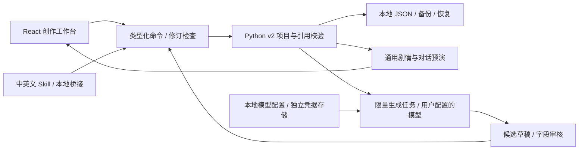

# NPCs AI Studio 数据与架构

当前主线使用 React 工作台、Python v2 本地 API、用户选择的 JSON 工程文件和通用确定性预演执行器。Python 项目是权威数据源，前端投影用于展示和提交类型化编辑命令，不再运行早期 JavaScript 示例模拟器。

## 作者数据与运行状态

项目层级是 **项目 → 共享世界底稿 → 关卡 → 场景**。角色档案在整个项目中共享；关卡出场引用角色，并独立保存场景、时间、条件、行为说明和对白绑定。NPC 组由出场记录组成，不复制人物档案。区域与局部剧情属于关卡，世界底稿保存全局前提、规则和写作风格。

| 数据 | 职责 |
| --- | --- |
| `content` | 世界、角色、地点、阵营、事实、变量、事件、规则、对话、文本、关卡，以及草稿与生成历史 |
| `content.initial_state` | 作者设置的预演起点，不是当前模拟结果 |
| 预演输入与结果 | Python 重放场景、选择和变量操作；结果不会自动改写人物设定 |
| `editor` | 画布、连线、卡片宽度与顺序、作者快捷备注、独立试玩记录及恢复标记 |
| 本地应用配置 | 模型档案、默认用途、模板与最近项目，独立于故事项目 |
| 独立凭据文件 | Windows 当前用户 DPAPI 加密密钥；不进入项目、导出、模板或 Skill |

稳定 ID 和类型化引用保证改名后连接仍有效。`revision` 控制事务冲突，`content_revision` 与 `layout_revision` 区分内容和布局变化；生成审核另使用作者内容摘要。纯外观布局和历史记录更新不应使候选文本失效。

## 当前模块

| 位置 | 职责 |
| --- | --- |
| `src/App.jsx`、`src/useLocalProject.js` | 工作台导航、本地项目接入与编辑状态 |
| `src/projectBridge.js` | Python 项目到界面投影，以及保留未编辑字段的命令转换 |
| `src/LevelCanvas.jsx`、`src/RoleWorkbench.jsx` | 关卡出场编排与角色对白编辑 |
| `src/LevelStory.jsx`、`src/RolePreview.jsx`、`src/Rehearsal.jsx` | 故事流、卡片试玩和运行时间线 |
| `backend/ludo_npc/domain/` | 数据契约与跨对象引用校验 |
| `backend/ludo_npc/application/` | 原子命令、项目会话与有界撤销/重做 |
| `backend/ludo_npc/storage.py`、`project_paths.py` | 用户项目目录、原子保存、文件锁、备份与恢复 |
| `backend/ludo_npc/simulation.py` | 场景存在性、条件、效果、事件/规则、重放与执行边界 |
| `backend/ludo_npc/generation.py`、`drafts.py` | 并发任务、取消/重试、候选校验、字段保护与采用 |
| `backend/ludo_npc/providers.py`、`credentials.py` | 模型请求与本地凭据隔离 |
| `backend/ludo_npc/skill_bridge.py`、`skills/` | 故事编译、作者上下文与待审核提案；中英文分发资源 |
| `backend/ludo_npc/templates.py`、`exports.py` | 独立模板库和可预览的作者交付导出 |
| `schemas/` | 由 Python 契约生成的项目、命令与 API Schema |

## 兼容边界与主线检查

旧 v1 工程通过明确迁移导入，浏览器旧存档通过 `src/legacyProjectStorage.js` 中的原存储键读取。迁移保留警告与旧预演输入，不猜测旧记录缺失的历史文本。`docs/examples/lighthouse.ludo.json` 是迁移测试夹具；它的固定故事 ID 不属于当前通用运行规则。旧 JavaScript 模拟器、旧时间线组件和对应测试已从主线移除。

`ludo_npc` 包名、`ludo-npc-project` 协议、既有浏览器存储键与 `.ludo.json` 扩展名保留兼容。中英文 Skill 的桥接和 Schema 副本由打包脚本同步，是分发所需资源。

`npm test` 自动发现并运行所有 `tests/*.test.mjs`；后端执行 `backend/tests`。发布前还需构建、Schema 漂移检查、帮助文本生成检查和 Skill 资源检查。真实模型效果与干净 Windows 机器验收分别进行，本地协议测试不代替这些验收。

详细 API 与开发命令见 [后端说明](../backend/README.md)，工作流与执行约束见 [产品计划](product-and-development-plan.md)、[第三批交付](batch-3-delivery.md)、[Skill 协同指南](skill-collaboration-guide.md)。早期交付记录作为历史证据保留，不作为当前架构入口。
