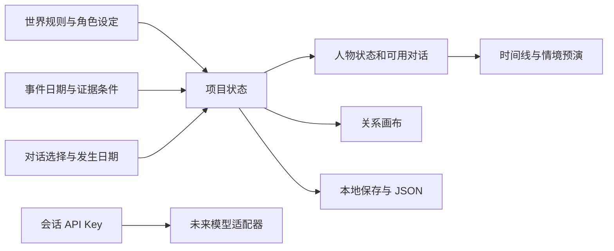

# 原型数据与架构

> 本文保留阶段 0 / v1 原型的历史架构。当前导演台使用 Python v2 API、本地 JSON 文件及通用预演执行器；参见 [第三批交付](batch-3-delivery.md) 与 [后端说明](../backend/README.md)。`src/project.js` 的旧示例规则仅保留作迁移回归，不计算当前页面的预演。

`src/project.js` 定义 v1 项目、示例剧情规则、格式校验和 JSON 序列化。`App.jsx` 持有唯一项目状态；画布、属性面板、时间线与对话预演读取同一份状态。

## v1 字段

| 字段 | 当前用途 |
| --- | --- |
| `version`, `name` | 格式版本与项目名 |
| `world` | 世界名称、区域、前提、规则、风格、版本 |
| `entities` | 五种对象：character / location / faction / event / dialogue；稳定 ID、设定与画布位置 |
| `relations` | 来源、目标、连接点、名称和事件/对话分类 |
| `dialogue`, `notes` | 内置剧情阶段文本与诊所信件 |
| `scenario` | 日期、证据、信任、承诺、知识及选择日期 |
| `modelProfile` | 接口地址与模型名；没有 API Key |
| `tasks` | 内容生成/写入记录 |

可导入的完整示例见 `examples/lighthouse.ludo.json`。该格式暂时要求 `eve`、`relic`、`retaliation` 及对应类型存在，以确保内置情境可运行。

## 状态约束

- 一次项目编辑立即进入所有视图，500 ms 后自动保存。关闭页面前尝试刷新保存。
- 事件发生需满足启用、日期及证据条件。人物状态和对话从当前情境派生。
- 伊芙状态轨道按逐日派生的状态合并，避免轨道与实际状态判断使用两套逻辑。
- 保护和来源选择带发生日期；向前回溯不会提前得到后续承诺/知识。信任数值暂为当前分支快照，尚无完整事件溯源。
- 重复保护或说明来源不会反复叠加信任。
- 导入只重建允许的字段，检查版本、引用、对象类型、日期、坐标和容量；未知字段、密钥丢弃。
- 图上的关系表示创作关联。目前只有内置剧情规则执行状态变化，新增连线不会自动变成运行规则。

## 扩展顺序

1. 将示例规则提取成通用条件、效果、知识事实、分支与时间事件；用版本迁移替代必须保留示例 ID。
2. 为任意角色编排可编辑的对话节点、选项、条件与效果，并提供可追溯的模拟日志。
3. 接入第三方模型适配器，携带经过裁剪的世界事实与人物上下文，返回可校验的结构化草稿；由用户审核后提交。
4. 加入任务取消、错误重试、批量生成、差异审阅与版本恢复，再考虑游戏文本格式导出。

视觉原型、项目规则与数据接口的职责保持清晰，避免让模型直接重写整个项目。
