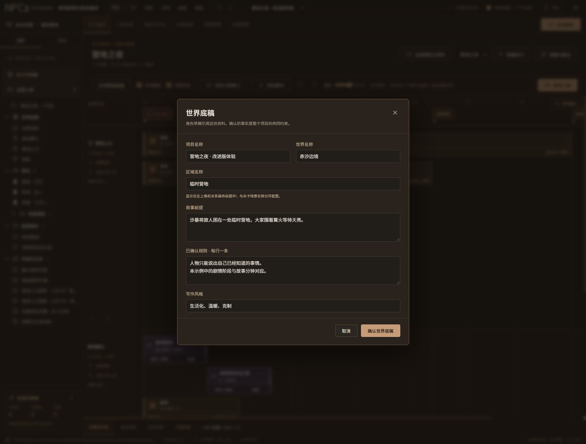

# 内容入口检查与区域编辑修复

日期：2026-10-07。范围：当前 Web 工作台显示的作者资料、条件、运行状态和历史记录，以及 Python 合同中的可选资料字段。检查方法：对照 `src/` 表单和导航、Python 数据模型，并在独立本地项目副本上操作浏览器。没有调用模型或复制凭据。

## 已修复

- `world.district` 补充「区域名称」，沿用世界底稿的稀疏提交、同字段冲突保护和关闭保存提示。左上角世界/区域名称可直接点击打开，清空区域显示「未设置区域」。区域独立于关卡场景名称。
- 左侧地点、阵营资料改为直接打开完整编辑弹窗，避免选中对象后属性面板被当前工作区隐藏。补充地点 `parent_id`、阵营 `policies` 和资料标签；保留已有 ID/引用，拒绝循环父地点与同字段覆盖。关系属性面板也提供「查看与编辑完整资料」。
- 左侧人物在关卡、总览、审核、全局预演页面直接打开人物档案；关系画布保留选中属性面板，工作台保留人物切换。对白直接进入对应工作台，非对话文本进入资料编辑表单。
- 本次新增文案和帮助已同时更新中文、英文与离线手册。
- 浏览器发现构建内嵌的小字体被当前 CSP 拦截。关闭构建资源内嵌，字体仍从本地加载，未放宽安全策略。重载后错误/警告列表为空。

## 内容入口清单

| 内容 | 查看/编辑入口 | 核对情况 |
| --- | --- | --- |
| 项目名称、世界名称、区域、前提、规则、风格 | 世界底稿；左上角世界/区域按钮 | 区域保存后读取本地 JSON 验证；正式项目只打开查看 |
| 故事时钟单位、起点、人物初始地点/行为/认知 | 关卡「全局规则与资料」→ 资料 → 初始状态 | 源码核对 |
| 地点名称、类型、说明、所属地点、标签 | 左侧地点 → 编辑地点；关系属性 → 完整资料 | 测试副本改名/说明/标签保存，ID 与原引用保持 |
| 阵营名称、类型、说明、政策、标签 | 左侧阵营 → 编辑阵营；关系属性 → 完整资料 | 保存/重开、两行政策、关闭提示、中英文浏览器验证 |
| 人物身份、定位、简介、故事、性格、口吻、目标、底线、待定资料、字段保护 | 人物档案；总览/关系菜单；左侧人物 | 在关卡页面点击左侧人物，确认打开完整档案 |
| 人物分组、快速备注 | 分组标签按钮/管理分组；卡片备注区 | 源码核对，共用稳定人物 ID |
| 关卡名称、横轴模式、轨道、地点引用、锚点时间与标记 | 场景与锚点；轴节点右键/双击/F2 | 源码核对 |
| 人物出场场景、时间、行为、条件与对白引用 | 配置出场；关卡出场检查；角色工作台 | 源码核对 |
| NPC 组名、场景、共同时间、各成员台词 | 组设置；成员编辑台词/编排与试玩 | 源码核对 |
| 剧情事件/规则的名称、说明、范围、条件、效果、启停、优先级与相关人物 | 关卡事件卡片/本关卡剧情/全局规则；左侧事件 | 源码核对 |
| 事实的名称、说明、真实性、可见范围、获知时间；变量类型与默认值 | 全局规则与资料 → 资料 → 世界事实/故事变量 | 源码核对 |
| 对白名称、节点文字/说话者、选项、跳转、条件、效果、开场规则 | 角色工作台；全局资料的对话定义 | 浏览器确认左侧对白进入对应工作台 |
| 非对话文本名称、类型、作者、正文、出现条件 | 左侧文本；场景内容 → 编辑文本与条件 | 浏览器确认能直接到正文表单 |
| 关系名称、方向、分类、说明、连接对象 | 关系连线/关系列表 → 编辑 | 源码核对 |
| 预演中的地点、行为、认知、变量和变化原因 | 预演/底部时间线与变化记录；故事卡片定位来源 | 运行结果由初始状态、条件与效果推导；不作为人物档案直接覆盖 |
| 草稿正文、说明、候选字段、失败详情 | 草稿审核卡片弹窗；高级字段/审核提醒 | 源码核对，已采用内容通过正式对象入口查看 |
| 试玩历史、旧路径记录、生成记录与来源 | 试玩记录列表/详情；全局记录；底部生成记录 | 历史快照保持只读，提供重试/重测或恢复路径 |
| 模型配置、路由、模板、导出 | 模型设置；模板库；导出预览 | 源码核对，凭据独立保存，不属于项目内容 |

## 仍缺少直接编辑表单的可选字段

以下字段存在于合同或导入资料中，本轮没有新增它们的常用表单，不能宣称整个合同已完全覆盖：

1. `Level`、`TimeAnchor`、`SceneTrack`、`NpcGroup` 继承的额外 `description` 与 `tags`。当前主要画布展示名称、时间、引用、颜色图标；这些额外元数据并无完整资料编辑入口。
2. 事件、规则、事实、变量、对白和非对话文本的通用 `tags`；非对话文本独立的 `description`。部分候选可在草稿高级字段中查看，但这不等于正式内容有方便的手工入口。
3. 旧 `SimulationCase` 的 `description`、`tags`、`notes`、`seed`。旧记录可查看已有路径及重新测试，附加元数据尚无完整编辑入口；不得为旧记录虚构历史正文。
4. 关系画布合同可存多个命名画布，但当前只使用第一个画布。独立画布名称/多画布管理仍属于后续范围，不能用区域名称代替其已实现的结论。

建议下一批把这些资料放在所属对象的「更多资料」中，避免堆到主画布，也避免要求用户手改 JSON。记录与运行结果仍通过查看和来源追溯处理。

## 验证证据与边界

- 前端测试：128 项通过，包含区域清空/并发修改、地点循环/移除、稀疏更新与阵营政策回归。
- `npm run build` 成功，Sites 所需输出保留；现有 bundle 大小提示仍存在。
- 独立 QA 服务 4185：区域保存入 JSON；地点改名/标签保存；阵营政策保存重开；未保存关闭三选项；左侧人物/文本/对白入口；英文表单。
- 窗口实际尺寸 500×844 与 1024×600；后者阵营保存栏底部为 583 px、人物档案操作栏底部为 574 px，均在视口内。Chrome 窗口最小宽度为 500 px，本次不能把请求的 390 px 当作实际验收结果。
- 构建 CSS 中 `data:font` 数量为 0；重载后浏览器控制台错误/警告为空。
- 正式项目在所有测试前后 SHA256 一致，保留「临时营地」原值；测试变更只在独立副本。正式 4184 服务继续运行，预览已刷新并打开区域编辑窗口。
- 本次没有重新打包 Windows、调用真实模型、推送仓库或发布。

## 后续处理（2026-10-07）

上文列出的关卡 / 轴节点 / NPC 组说明与标签、剧情对象标签、独立文本说明和旧记录资料入口已在下一批补齐。详见 [更多资料补全验收](../more-details-20261007/report.md)。多画板组织与纯净 Windows 验收仍分别规划。
