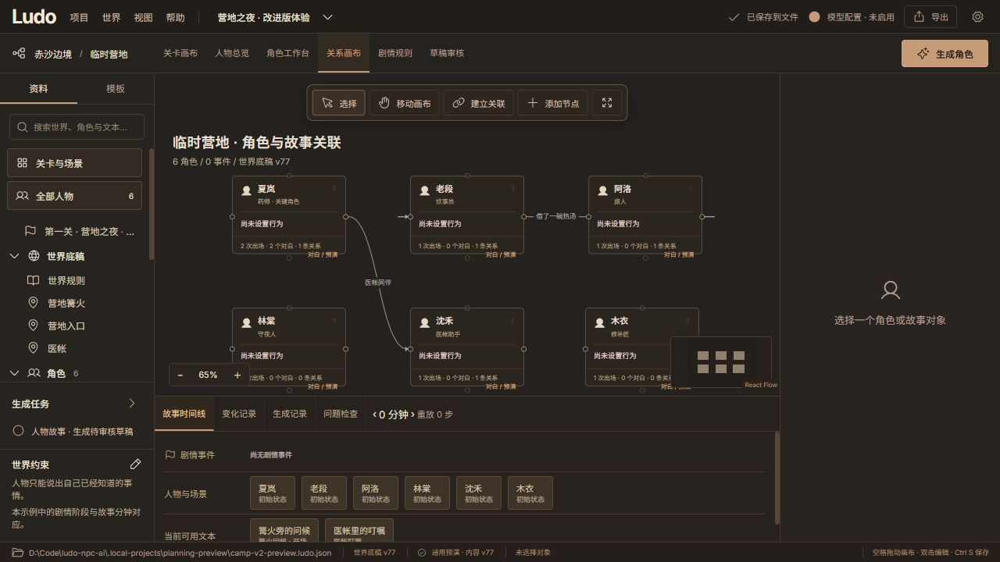
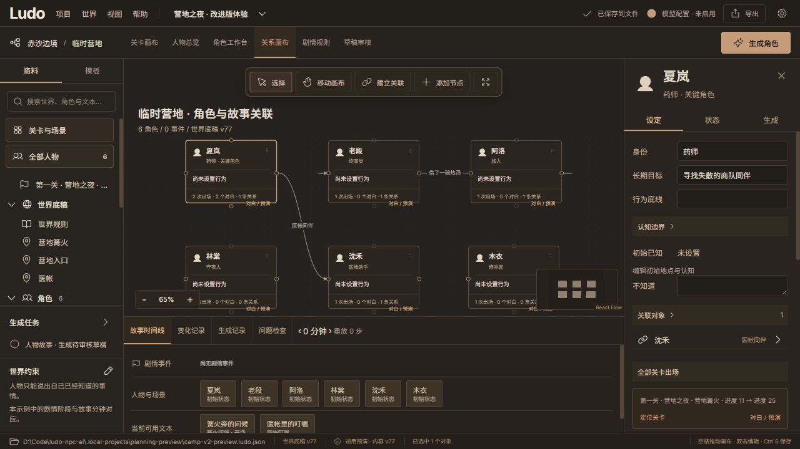

# 关系画布评估 · 2026-10-06

范围：当前营地示例的关系画布、人物详情和关系编辑。仅查看与截图，未修改代码、人物、关系或项目内容。样本为 6 人、2 条关系；大量节点、键盘完整流程和辅助技术兼容性未验证。

## 1. 查看画布：基本可用，整理与阅读能力不足

- 已有中央工具栏、缩放、缩略图和带名称连线。
- 六张人物卡重复“尚未设置行为”，中央正文没有提供关系规划价值；分组和目标缺少直接展示。
- 当前 65% 缩放下文字很小，卡片底部动作看起来伸出边界，缩略图和缩放栏占用下方节点附近空间。
- 建议人物卡显示身份、分组、目标摘要；把初始设定与预演状态区分。信息统计改为独立可点击入口，动作行留足空间；远景简化卡片，聚焦局部时显示摘要。
- 搜索人物、按分组/关卡/场景/关系类别过滤、聚焦直接邻居、回到全部，可减少连线干扰。场景过滤需要注明来自出场安排，不代表关系仅在该场景成立。

## 2. 选中人物：联动已有基础，入口可更集中

- 属性栏已有关联对象、全部关卡出场、定位关卡和角色工作台入口，不需要重复建立人物档案。
- 当前设定表单占据属性栏前半部，关系和出场信息靠后。建议在关系画布的属性栏默认显示关系摘要、出场概览与分组，长篇设定进入详情。
- 人物总览、关系画布、关卡和对白继续引用同一人物 ID；图上的整理不能复制人物内容。
- 人物逻辑分组允许多归属；画布容器只负责空间整理。可按一个选定分组维度布局，其他分组显示标签，避免多归属人物被强制归入单一容器。

## 3. 编辑关系：轻量可用，表达能力有限

- 当前提供关系名称和快捷名称建议，支持保存/删除。
- “相互信任”与“夏岚 → 沈禾”的默认箭头表达存在语义歧义。建议明确单向/双向、关系类别、说明；样式跟随类别，文字仍保留。
- 建议提供关系列表：源对象、关系、目标对象、方向、类别；可搜索、编辑和定位连线，大量关系不必都通过鼠标寻找。
- 建立关系除了连接点拖拽，应提供选择源/目标的表单；连线支持单击详情、右键操作和键盘入口。

## 优先顺序

1. 卡片层级与动作布局、搜索/过滤、邻接聚焦、人物分组入口、明确关系方向及关系列表。
2. 多选批量移动、对齐/等距、可折叠整理容器、自动排布预览与撤销、保存视图。移出视图保留人物和关系；已有对象引用入口与新建对象分开。
3. 多关系画布共用人物与关系，每个画布独立位置/可见性；按剧情阶段显示关系成立条件和来源。静态关系标签不应直接触发预演效果。

视觉与可访问性：小字号、低缩放、连接点小目标和依赖双击的操作有风险；提供文字/图标双重标识、可见焦点、键盘和表单替代入口。此评估不构成 WCAG 合规结论。

下一步建议先完成第 1 项，让设计师在同一画布完成查找人物、聚焦关系、修改分组和进入出场/对白。
