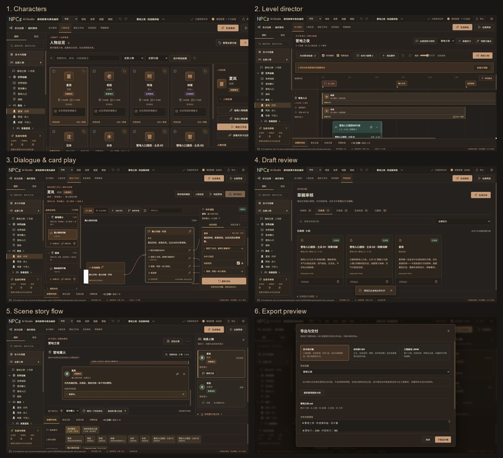

# NPCs AI Studio 系统流程与屏幕适配审查

日期：2026-10-06。对象：当前本机 Web 构建与 Python 后端，不等同于 Windows 发行验收。

结论：主要模块已经相互连接，当前重点应从增加模块转为完成响应式布局、编辑保护和异常恢复。发现 3 项优先处理的问题，以及若干流程一致性和发行准备事项。不能据此宣称所有服务商、设备或发行包均已验收。

## 方法与范围

- 在真实浏览器中检查新建工程、世界底稿、人物总览、关卡、角色对白、关系画布、生成入口、草稿详情、关卡试玩、试玩记录、模板和导出预览。
- 为有写入的验收单独启动 4185 服务。使用独立应用数据目录和工程副本；新建空白工程、临时试玩及保存验收记录均只发生在 `.local-build/system-audit-20261006/`。
- 正式用户工程没有提交编辑、采用草稿或保存验收记录。没有读取/填写真实 API Key，没有发起外部模型请求，没有推送或发布。
- 截图均为本轮采集。截图原始编码为 JPEG，按 `.jpg` 保存；完整尺寸见 `screenshots.json`。部分早期截图在视口切换中采集，实际尺寸与文件名不一致，报告只将重新采集或尺寸核实的截图作为相应尺寸的证据。
- 以下“完成”指当前存在相应能力；本轮实测与自动化验证分别注明。未对每种拖拽、每个菜单组合和每种供应商做穷举验收。

## 1. 顺着设计师的创作流程检查

| 步骤 | 当前能力与本轮证据 | 状态与改进点 |
| --- | --- | --- |
| 1 新建/打开工程 | 实际创建独立同名项目文件夹，工程路径正确；最近项目可回到验收副本 | 可用。空白页只强调创建关卡，建议补一个轻量创作路线：世界 → 关卡/场景 → 人物 → 出场 → 对白 → 试玩。不是强制向导 |
| 2 世界与共同事实 | 世界底稿弹窗、已确认规则、事实与变量入口存在 | 需修正：世界底稿关闭时没有未保存保护，输入直接丢弃 |
| 3 人物管理 | 人物总览、叙事定位标记、分组、快速备注、出场及对白入口存在；档案稀疏更新/冲突保护测试通过 | 已连接。角色定位、身份、通用分组、场景 NPC 组仍应继续使用清楚、统一的名称 |
| 4 关卡安排与剧情规则 | 场景轨道、时间锚点、人物出场、NPC 组、剧情卡片及联动检查存在；同页抽屉配置作用域、条件、效果 | 已实现，无须再补一块独立剧情画布。复杂规则抽屉可进一步折叠章节，降低上下滚动负担 |
| 5 角色对白编排 | 同一人物的多次出场各自关联对白；卡片、选项、条件与测试同页 | 实测开始卡片试玩后将“玩家受伤”设为是，仍停留在开场且第二选项可选。窄屏布局和旧标签页恢复需优化 |
| 6 生成与草稿审核 | 未启用模型时显示配置引导；草稿状态、已采用详情、对应场景与正式内容入口存在 | 卡片收件箱比堆叠全文清楚。真实模型输出质量本轮未测；失败恢复/删除采用自动化结果，不冒充本轮真实请求验收 |
| 7 关卡试玩 | 在场人物卡、环境文本、事件、玩家回答和对白进入线性故事流；执行了治疗选项并进入“处理伤口” | 主要链路可用。旧操作路径失效时会锁定继续操作，恢复入口应放到诊断旁 |
| 8 历史与恢复 | 保存“系统流程验收记录”，刷新后仍能在记录列表找到；详情保留当时对白和条件 | 持久化闭环实测通过。角色卡片试玩记录与关卡记录分开显示，建议互相提供入口/标明来源，避免误认为记录丢失 |
| 9 模板与交付 | 本地人物/对白模板、归档入口存在；设计稿生成预览展示范围、人物、出场、对白和规则；JSON/CSV/模板规则有自动化覆盖 | 设计稿遗漏新增加的关键/支线/背景定位，需补齐。实际下载、再导入和原生选择器完整交互本轮未重新验收 |

流程缩略图；各原图可在本目录查看：

## 2. 屏幕适配结果

以下是 CSS 视口尺寸，不是 Windows DPI、浏览器缩放或触摸设备的实机验收。

| 视口 | 实际情况 | 建议 |
| --- | --- | --- |
| 1920×1080 | 角色编辑/预演可并排；有足够画布空间 | 保留专业多栏布局 |
| 1366×768 | 主页面与审核/导出弹窗基本可用；全局入口显示 | 作为桌面常规验收基线 |
| 1280×720 | “全局预演”入口直接隐藏，没有明显替代入口 | 优先修复：保留图标、短标签或“更多”菜单，不能通过隐藏功能来适配 |
| 1024×768 | 左侧可收起，但角色出场库、画布、260px 预演仍同时占宽；英文工具栏换行 | 使用可折叠出场库、编辑/试玩切换或可调侧栏。审核弹窗仍可滚动，操作栏可见 |
| 760×900 | 角色工作台按“出场库 → 550px 编辑器 → 预演”堆叠；预演初始位置约 y=1056，首屏看不到 | 试玩通过滚动可达，不是功能消失；建议窄屏用编辑/试玩页签，避免来回穿过整个编辑器 |
| 390×844 | 顶栏项目/保存等控件超出可见区；工作区标签可横向滚动；全局动作隐藏 | 目前不适合完整手机创作。建议先明确手机仅查看/试玩，或为完整创作补独立窄屏导航 |
| 1366×600 | 世界弹窗的确认按钮初始部分裁切，需要滚动；Tab 能使其进入可见区 | 统一固定弹窗标题与操作栏，只有正文滚动 |

建议先保证 1024px 及以上桌面窗口所有能力可达，再完善平板布局。Windows 125%/150% 缩放会压缩可用视口，需追加实机检查；不能只按显示器物理分辨率判断。

## 3. 优先修复的实际问题

### P1-A 缩小窗口会丢失“全局预演”入口

- 复现：1366px 显示入口，切至 1280px 后不显示；760px 以下全部 `context-actions` 隐藏。
- 影响：用户不知道如何进入完整关卡试玩。顶部“视图”目前是属性面板切换，不是完整工作区导航兜底。
- 根因位置：`src/styles.css:337` 的 `.preview-action { display:none; }`；`src/planning.css:159` 的 `.context-actions { display:none; }`。
- 建议：能力不随尺寸消失；长标签逐步缩短或收进可见的更多菜单，给全局试玩固定导航入口。
- 验收：中文/英文在 1280、1024、760 宽度均能从当前页进入全局试玩。
- 证据：[1280px 关卡页面](10-level-1280.jpg)、[1366px 场景试玩](18-global-dialogue-1366.jpg)。

### P1-B 世界底稿没有未保存关闭保护

- 在隔离空白工程中修改世界名称，点关闭按钮；没有保存/放弃/取消提示。再次打开，名称回到“未命名世界”。
- 根因位置：`src/App.jsx:233` 的 `WorldModal` 直接使用 `onClose`；通用 `Modal` 的 X、Esc 和背景关闭都会交给同一回调。
- 建议：世界底稿与对话/档案编辑采用一致的脏状态保护；保存成功才关闭，失败保留输入。逐一检查其他手工编辑弹窗，而不是只补一个入口。
- 验收：修改后通过 X、Esc、背景退出都能选择保存/放弃/取消；取消和保存失败都保留输入。
- 参考界面：[世界底稿](02-world-1366.jpg)。

### P1-C 工程版本过期后缺少就地恢复

- 正式预览的旧标签页使用内容 v194，而当前工程已经是 v195。预演提示内容版本变化并禁用开始，但没有清楚的重新载入最新工程操作。
- 服务端拒绝过期请求是正确保护，不应去掉 revision 检查。问题是恢复路径，而非模型或对白引擎失效。
- 根因关联：`src/useDialoguePlay.js:34` 使用当前标签页的 `expected_content_revision`；本地重试不会自动获得新的工程快照。
- 建议：提示中提供“载入最新工程”；有未提交编辑时先保留/处理编辑冲突，不能强制刷新丢弃内容。
- 验收：两页打开同一工程，一页改动后另一页可明确刷新内容并恢复试玩；未保存编辑得到保护。
- 证据：[过期页面的角色预演](05-role-1280.jpg)。

## 4. 同批建议完成的体验问题

| 编号 | 问题 | 建议与验证方式 |
| --- | --- | --- |
| P2-A | 窄屏编辑与试玩分离太远、多层滚动 | 改为窄屏编辑/试玩切换；共享人物/场景上下文；不丢弃临时试玩。证据：`25-role-760-drawer-closed.jpg`、`26-role-760-scrolled.jpg` |
| P2-B | 低高度世界弹窗需要把整个弹窗滚动才能看到确认按钮，标题也随之离开 | 固定标题/底部操作区，正文独立滚动；复测 600px 高度及长内容。证据：`34-world-short-1366x600.jpg` |
| P2-C | 旧试玩路径与新出场范围冲突时，场景切换/等待都禁用；重新开始藏在更多菜单 | 在诊断旁显示“重新选择起点 / 重新开始”，保留查看原因。重启已实测可恢复交谈，不应把此诊断当作引擎坏了。证据：`17-global-blocked-1366.jpg` |
| P2-D | 英文模式部分产品提示仍是中文 | 实测 `试玩记录 3` 是动态拼接键，切换语言后既有的 `玩家状态已调整，保持当前对白。` 通知也保留中文；作者故事/姓名保留中文是预期。记录数量使用插值键，通知保留语义再按当前语言渲染。当前字面翻译测试不能覆盖所有拼接和状态切换。证据：`28-role-english-1024.jpg`；`src/RolePreview.jsx:71,94` |
| P2-E | 导出设计稿未携带新角色定位 | 当前只导出身份、描述、故事等，`backend/ludo_npc/exports.py:132` 附近缺少 `importance`；补关键/支线/背景定位与名称映射。JSON 工程备份保留原始字段，不存在同样遗漏。证据：`20-export-1366.jpg` |
| P2-F | 初次空白工程的下一步不完整 | 给可关闭的路线提示和条件对应的空状态按钮，例如先完善世界、创建人物、安排出场；不要增加永久复杂面板。证据：`14-blank-project-1366.jpg` |
| P2-G | 关系属性区还保留旧版“通用对话预演”及条件列表，与新的角色工作台试玩方式不同 | 优先保留摘要和“打开角色工作台”，详细试玩统一到新流程；角色与关卡历史入口明确各自作用范围。证据：`29-relationship-1366.jpg` 及本轮 DOM 检查 |

其他可访问性观察：小号次要文字、缩小画布后的卡片、部分图标控件仍需要桌面缩放与键盘验收。此次没有进行 WCAG 对比度数值测量或完整屏幕阅读器验收，不能宣称无障碍合格。右键轴节点已有键盘入口，不应为了简化外观取消该入口。

## 5. 真正未完成/待确定的范围

### 发行前待完成

1. **重新打 Windows 包并验收。** 最新的双语体验包构建时间是 22:03–22:04，早于后续全局故事流、底部布局和角色标记变更；包内 JS/CSS 引用与当前 `dist/client/index.html` 不同。不能用网页已通过来代表该包具有最新能力。
2. **干净 Windows 环境与原生文件选择器全流程。** 新用户、无需 Python/Node、端口占用、路径选择/取消、数据位置、保存重开、升级旧目录读取都应纳入。当前程序是本机 Python 服务加浏览器 UI，尚无独立原生桌面窗口外壳。
3. **正式服务商兼容与输出质量。** 本轮无真实调用；历史工程有真实模型来源不意味着所有当前连接已通过。首版明确支持 chat/completions 兼容文本协议；不能宣称任意供应商原生协议均支持。
4. **开源许可与贡献规则。** 根目录没有 LICENSE；README 也仍标注许可/贡献规范待确定。公开发行前确定具体许可证和示例素材范围，并整理旧交付包/旧版本说明，避免下载到不同能力版本。
5. **尺寸与发行基线。** 建议把 1366×768、1280×720、1024×768、短窗口、英文长标签、Windows 125%/150% 缩放列入固定验收；手机完整编排是否承诺需明确。

### 后续扩展，不能当作当前承诺

- 周期事件、每日作息、岗位替补、资源/阵营/区域生态；当前执行的是明确条件与一次性效果，不会自动理解行为备注并模拟完整生态。
- 自然语言故事矛盾、人物动机、秘密泄漏的语义检查；当前结构/引用/条件校验不能代替作者审核。
- 关系多画布、框选/批量整理、自动排布、大规模关系图组织；当前已有过滤、直接关联高亮、分组和关系列表。
- Yarn/Ink/Unity/Godot 等专用适配；当前设计稿、CSV、工程 JSON 已提供，但不是游戏运行时插件。
- 非 Windows 的安全持久密钥存储；当前 Windows DPAPI 与项目分离，其他系统按会话使用，不应改成明文工程保存。
- 更多供应商协议、较大生成批次和全工程批量覆盖测试；需要在具体场景、容量与供应商上分别验证。

没有遗漏的已实现部分：独立工程文件夹、世界/人物/关卡引用联动、NPC 组逐人对白、草稿弹窗审核、可恢复删除、分组管理、角色定位、统一手工档案、模板、设计稿/CSV/JSON、本机密钥和中英文 Skill 均已有实现。它们仍需要回归验收，但不应再次列为“从零开发”。

## 6. 本轮验证结果与限制

- `node --test tests/*.test.mjs`：**120 passed**。
- Python 完整测试：**310 passed**，使用独立 basetemp。
- `python -m ludo_npc.tools generate --root . --check`：**7 个 contract/sample 文件通过**。
- 额外独立运行 `npm test` 6 项、`npm run test:bridge` 9 项通过，包含在上述前端总套件中，不能相加重复计数。
- 浏览器实测：独立同名文件夹创建；最近项目打开；世界输入关闭丢失；既有草稿列表/详情；全局重启恢复、角色交谈/治疗选项；卡片试玩原地调整变量；记录保存并刷新后查找；模板入口；设计稿预览；多个视口和英文模式。
- 隔离验收页面浏览器 error/warn 日志未观察到框架异常；这不代表所有路径均无异常。
- 没有进行真实付费模型调用、干净机器安装、Windows DPI 实测、完整屏幕阅读器/对比度验收、压力测试、下载后交付再导入或第三方 AI 客户端的实际 Skill 执行验收。

## 7. 推荐下一批推进顺序

1. **完成适配与编辑保护：** 核心入口永不隐藏、侧栏折叠、窄屏编辑/试玩切换、统一弹窗操作栏、世界底稿关闭保护、过期工程重新载入。
2. **完成流程一致性：** 预演诊断就地恢复、历史来源入口、英文运行时提示、导出角色定位、轻量空白工程引导。
3. **形成可分发版本：** 更新统一说明和许可决定，重打 Windows 包；用同一套小型创作样例走新建 → 生成 → 审核 → 关卡试玩 → 保存重开 → 导出，并追加干净环境验收。

本轮只检查、运行现有测试和保存审查证据，没有修复产品源码。建议先完成前两批，再决定是否推进生态和引擎扩展。
