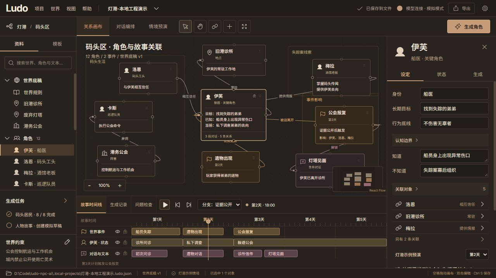

# 第二批交付：本地工程与导演台接入

2026-10-05。沿用选定的暖灰铜色设计，React 导演台已经接入 Python v2 数据及本地 JSON 文件。已保存工程不依赖浏览器存储，也不需要外部数据库。

## 已实现

- 项目菜单：新建、打开、最近项目、保存、另存为、备份恢复、v2 JSON 导出。
- 新建支持空白、灯港、独立荒原驿站三个模板，每次创建新的项目 ID。系统文件/目录选择按钮配合完整路径输入。
- 世界底稿、角色属性、卡片位置/可见性、关系/连接点接入 Python 编辑命令；可以编辑已有对话节点和非对话正文，保留条件、选项、效果和跳转。
- 编辑停止约 700 ms 后自动保存，拖拽释放后保存最终位置；磁盘提交成功才显示“已保存到文件”。底部显示完整路径，Ctrl S 执行实际文件提交。
- 保存失败保留窗口编辑，明确提示，可重试或另存副本。外部修改/删除触发冲突，拒绝静默覆盖；另存为拒绝覆盖已有文件。
- v1 打开后迁移到内存并要求另存为，不修改原文件；旧浏览器存档可迁移。
- 无密钥连接档案写入本机配置。API Key 只在页面会话中，刷新后消失；没有真实模型调用。

完整应用入口 `http://127.0.0.1:4174/`，开发前端为 4173，开发说明页为 `/docs`。目前已启动完整应用并打开“灯港-本地工程演示”。



## 存储位置与行为

默认建议工程目录为当前用户 `Documents/Ludo Projects`，用户可以选择其他本地目录。Windows 配置默认在 `%LOCALAPPDATA%/Ludo NPC AI/settings.json`，记录目录、最近 20 个工程和不含凭据的连接档案。

```text
用户选定的目录/
  我的世界.ludo.json           正式 UTF-8 工程
  我的世界.ludo.json.bak       上一份有效版本
  我的世界.ludo.json.history/  最多 20 个历史点
  我的世界.ludo.json.lock      操作系统写锁的旁文件
```

复制主 JSON 可以迁移核心工程，备份/历史可一起复制。锁在进程退出后释放，留下锁文件不表示还被占用。保存先写同目录临时文件并刷新，再原子发布/替换；首次保存的独占发布避免覆盖竞争出现的目标。恢复增加修订号并备份替换前的文件。单文件当前限制 20 MB，尚无大规模容量验收。

本次服务使用 `--data-dir .local-data --project-dir .local-projects`，这是仓库内的受控开发覆盖，用户默认目录在源码之外。未绑定文件的临时工程仍在服务内存，退出前需另存为。应用配置失败有警告，不影响已经保存的工程；损坏配置保留原文件。

工程结构不包含连接档案或密钥字段。不会扫描自由故事正文猜测凭据，作者输入的正文照常保存。

## 验证结果

环境：Windows 11 build 26100、Python 3.13.9、Node 24.14.0、PyInstaller 6.22.3、Tcl/Tk 8.6.15。使用独立 `backend/.venv`，`pip check` 通过。精确依赖约束在 `backend/requirements-dev.lock`。

| 检查 | 结果 |
| --- | --- |
| Python 测试 | 80 项通过：数据/迁移/命令/会话、文件新建/保存/恢复、进程锁、外部冲突、磁盘失败、实际子进程异常退出、样式加载安全策略 |
| 前端与 v2 桥接 | 13 项通过：示例预演回归、独立人物、布局、条件/引用保留、连接档案排除；桥接命令由实际 Python 处理器验证 |
| Sites 构建 | 4 项通过；指定 worker 和准备脚本保留，未发布站点 |
| 契约与代码 | 6 个生成物漂移检查、Ruff 格式/规则检查、依赖检查通过 |
| 程序包 | 16 项真实 HTTP/进程检查通过，见 [程序包报告](verification/batch-2-package.json) |
| 浏览器 | 新建、自动保存、实际拖拽、刷新、文本编辑、另存为、备份恢复、外部冲突保留及另存副本；9 项磁盘结果断言，见 [浏览器报告](verification/batch-2-browser.json) |

独立驿站验证中，修改目标和拖拽坐标实际落盘；对白编辑后两项原有选项保留。副本恢复了旧目标。外部修改工程名后保存返回 409，外部文件保留，窗口中未保存的目标写入新副本。

完整页面视觉复查发现原 CSP 拦截自身样式文件，已修正并增加 CSS 响应及策略回归检查；允许自身样式和画布所需内联位置，保留同源脚本限制。最终页面重启后重新打开演示工程并恢复选定设计，最终标签页没有控制台错误。

## Windows 早期程序包及限制

`./scripts/package-local.ps1` 生成 `release/LudoNPC/LudoNPC.exe`。必须保留整个 `LudoNPC` 文件夹及 `_internal`；双击入口启动本机服务并打开浏览器。程序包自带 Python 运行库、前端及示例，不需要另开 Node 服务。关闭控制台退出。

`scripts/verify-package.py` 直接运行 exe，使用独立测试目录和 4176 端口，检查内置页面/JS/CSS/CSP、新建、编辑、保存、备份、终止/重启、最近项目、内容/位置一致、恢复、另存为和拒绝覆盖。

尚未在没有 Python/Node 的干净 Windows 环境验收。默认端口占用处理、安装/退出体验、签名、许可证和正式发行属于后续工作。源码下载仍需安装开发依赖，当前不描述为已公开发行的即用产品。

原生选择器实现与运行库已经接入，适配器取消逻辑有测试。本次浏览器自动化无法完整操作 Windows 原生窗口，因此完整选择/取消流程尚未端到端验收；完整路径输入已验证。

## 下一批

第三批实现通用时间、场景条件、人物认知、事件效果、对话分支、回溯日志和变化解释；以灯港和独立驿站两个世界共同验收。当前独立世界显示定义及静态初始状态，灯港明确标注示例预演，v2 的条件声明尚不是通用执行引擎。

第四批才接真实模型、上下文组装、结构化生成、差异审核和小批次任务。模拟草稿仍为原型流程；通用确认字段保护和过期合并未实现。本批没有远程模型调用、云存储或发布部署。后续继续按 [整体规划](product-and-development-plan.md) 推进。
