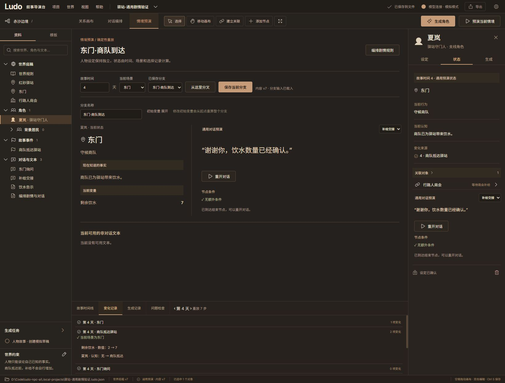

# 第三批交付：通用剧情与对话预演

交付日期：2026-10-05。对应整体规划的批次 3 / 阶段 2。在第二批本地工程之上接入通用 Python 执行器，并保留已选定的暖灰、铜色、卡片画布和导演台布局。

## 可以实际使用的功能

“对话编排”现在提供结构化编辑：事件、一次性规则、对话图、非对话文本、世界事实、变量和初始状态。可以编辑日期、优先级、条件、效果、人物地点与知识；对话支持说话者、条件入口、节点文本、玩家选项、选择效果、跳转、汇合与结束。表单通过原子命令提交，引用或类型错误会拒绝整笔修改。

“情境预演”提供任意非负整数故事时间（天、分钟或章节单位）、场景、初始变量覆盖、人物状态、可用对白和文本。可保存/切换分支、回到过去、从此处分叉，再继续选择。右侧状态和底部时间线读取同一份 Python 结果；“变化记录”展示触发条件、来源对象及前后值，“问题检查”展示跳转和执行诊断。

作者定义、初始状态、分支输入和计算结果保持分开。拖动卡片只改变布局；预演不会把当前行为、知识或信任写回人物设定。分支保存包含时间、初始变量、场景记录及玩家选择，进入本地项目 JSON，并随项目导出。没有云端存储或真实模型请求。

## 执行语义

| 内容 | 本批实现 |
| --- | --- |
| 条件 | 无条件、全部/任一/取反、布尔/数字/字符串变量比较、时间、事件是否发生、人物是否知道事实、人物地点、当前预演场景 |
| 效果 | 设置/累加变量、授予事实、改变人物地点/行为、解锁文本；类型和引用均校验 |
| 时间 | 从初始时间重放到目标时间；按事件日期、时间条件边界、事实有效时间与输入记录建立关键时间点，无五天限制 |
| 顺序 | 同一时间先结算事件/规则，再按 `sequence` 处理场景与选择，每次操作后重新结算；事件按计划时间、优先级降序、ID，规则按 ID |
| 一次性 | 每条事件/规则在同一分支重放中最多触发一次；未满足条件的到期事件继续等待，条件满足后再触发 |
| 对话 | 首个满足条件的入口优先，否则默认入口；查看入口不执行节点效果，开始/重开/选择进入节点时执行；选项条件与目标条件共同校验 |
| 回溯 | 未来的场景与选择保留在输入中，早期重放不执行它们；知识、承诺、变量增量均按实际发生时间还原 |
| 分叉 | 先保存有改动的原分支，再复制当前时间及以前的记录；未来记录仍留在原分支，不带入新分支 |
| 文本 | 受自身出现条件控制；若被解锁效果引用，还必须先解锁，解锁不能绕过场景/认知条件 |
| 版本 | 请求必须提供内容修订号；过期返回 409，界面随内容变更重算并丢弃过期响应；布局变化无需重算 |

对话记录支持 `choice`、`start` 和 `restart`。无效选择不会留下入口效果或半次跳转的修改，会给出诊断；显式结束后需要重开。没有 `sequence` 的旧 v2 记录使用兼容的稳定顺序，新界面为同一时间的场景与选择保存统一序号。

默认执行上限为 2048 步，API 可设 1–10000 步；每张对话图在一次重放中最多进入 128 次节点。达到上限时明确返回 `complete: false` 与诊断，界面停用继续选择，避免把部分结果当作完整剧情。允许作者设计循环，不保证每个循环都可继续无限预演。

事实 `available_at` 约束知识授予。授予未来事实会阻止整组效果，不会先执行补给或信任修改。公开事实不会自动成为所有角色的知识；文本是否包含秘密仍需作者正确设置引用和条件。

## 本地使用与保存

编排表单点击“提交剧情定义”后保存，尚未提交的表单会提示未保存状态。预演时间、变量、场景和选择点击“保存当前分支”后写入工程；有未保存输入时阻止切换项目/分支，并提示保存或放弃。回溯后如果还保留未来记录，保存用例的时间取最新记录时间，因此重新打开该用例时会回到最新记录；要保存另一条过去路线，应从此处分叉。

分支的变量覆盖是初始参数，改变它会重算整个分支。当前执行器不使用计算快照缓存；重复请求直接从初始状态计算，因此内容修改后不存在旧快照继续生效的问题。改期会重算状态和可用性，作者写下的自然语言正文不会自动改写。

源码开发仍使用仓库内 `.local-data/` 与 `.local-projects/` 覆盖目录。正常程序默认建议保存到用户 `Documents/NPCs AI Studio Projects`，配置在 `%LOCALAPPDATA%/NPCs AI Studio`；工程可保存到用户选择的文件夹。运行中的完整入口为 `http://127.0.0.1:4174/`。程序包是 `release/LudoNPC/`，需要保留整个文件夹。

## 验证证据

| 检查 | 结果与范围 |
| --- | --- |
| Python | 100 项通过，其中新增 20 项通用预演测试；覆盖回溯、分支隔离、日期变化、条件嵌套、未来知识、选择回滚、循环限制、稳定顺序、场景/选择混合顺序、保存用例与内容版本 |
| Node | 17 项通过：13 项前端/迁移桥接和 4 项 Sites 静态输出；旧 JS 示例测试作为迁移回归，当前预演不再调用旧引擎 |
| 契约/依赖 | 6 份 Schema/样例检查无漂移；Ruff 检查与格式通过；pip 依赖检查通过 |
| 构建 | 前端与 Windows 文件夹式程序包构建完成，保留 Sites 输出结构；没有发布或部署 |
| 程序包 | 24 项真实 HTTP 检查通过：启动 exe、自带前端、场景事件、条件选项、回溯、分支隔离、落盘、终止/重启、重新打开及相同重放结果 |
| 浏览器 | 灯港和独立驿站均实际操作；原分支保留未来选择，过去分叉无泄漏；手动改期/场景条件、新建对话节点/选项并保存，服务重启后重新载入；收尾控制台未见错误 |

程序包证据见 [batch-3-package.json](verification/batch-3-package.json)，浏览器操作与落盘复核见 [batch-3-browser.json](verification/batch-3-browser.json)。自动复现程序包检查：`backend/.venv/Scripts/python.exe scripts/verify-batch-3.py`。上一批文件写入失败、外部冲突、备份恢复等用例继续保留。

灯港浏览器路径：第 3 天公开证据，选择保护伊芙，行为变为愿意出庭作证、信任增至 2；回到第 2 天，追捕认知与承诺未提前出现，信任回到 1；分叉保留原分支第 3 天的选择。

驿站浏览器路径：把商队日期改到第 4 天，条件设为当前场景东门；未进入东门时饮水仍为 2，夏岚不知道到达事实；进入东门后饮水为 7，获得事实并开放询问选项。另手动创建“补给交接”对话，两节点由“我来帮你清点”选项连接，点击后显示完成文本。场景和两个选择在同一天按序号 0、1、2 落盘，重启后重放一致。

Windows pytest 的默认临时目录清理遇到权限错误，改用仓库内专用 `--basetemp` 后全量测试正常结束。没有将此环境错误计为测试通过，也没有更改系统临时目录权限。

## 尚未交付

周期事件、酒馆换班等日程、完整群体生态、计算快照与大规模性能仍待后续阶段。结构检查与显式事实条件已经执行，但没有自然语言语义审校或自动检测对白中的秘密。部分扩展属性仍可通过协议编辑，结构化表单不声称覆盖所有模型字段。

程序包是早期版本，尚未验证无 Python/Node 的干净 Windows 环境、完整原生选择/取消流程、安装体验与端口冲突处理。源码和打包包均未公开发行，许可证仍待确定。

下一批为模型生成与草稿审核：连接测试、协议适配、上下文整理、结构化角色/故事/对话草稿、字段差异、确认字段保护、过期草稿检查、小批次任务及取消。生成必须先进入草稿，审核后再通过原子命令进入正式工程。
