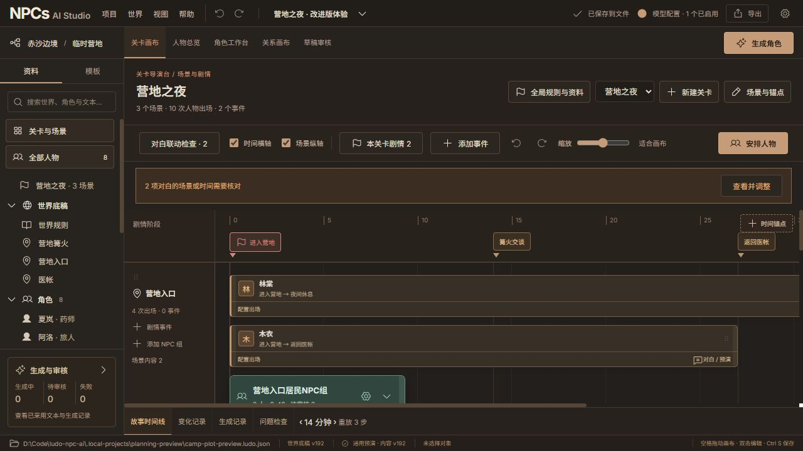

# NPCs AI Studio 品牌统一交付

> 当前 Skill 主线为 0.1.0 预览版，中英文固定下载包见 [协作使用说明](skill-collaboration-guide.md)。下方验收记录为历史证据。

2026-10-06。正式名称为 **NPCs AI Studio**，定位为「游戏叙事与角色编排工作台」。

## 已同步的入口

- 控制台顶部品牌、浏览器标题和页面描述、旧工程导入错误提示、系统文件选择器、导出默认文件名。
- 本地 API 文档标题、开发服务页、启动器输出、Python 工具描述与分发元数据。
- 两份自包含 Skill 的目录、frontmatter 名称与描述、标题、参考说明、桥接脚本路径和宿主元数据。调用名为 `$npcs-ai-studio-zh` / `$npcs-ai-studio-en`；脚本为 `scripts/npc_studio_bridge.py`。
- Windows 文件夹和可执行文件为 `NPCsAIStudio/NPCsAIStudio.exe`，文件属性的产品名与说明为 NPCs AI Studio；同包包含中英文 Skill 和协作说明。
- README、规划文档、协作说明、Windows 指南、维护规则及打包/验证脚本。

## 本轮下载包

- 中文：`../release/skills/npcs-ai-studio-zh.zip`。
- 英文：`../release/skills/npcs-ai-studio-en.zip`。
- Windows：`../release/npcs-ai-studio-preview/NPCsAIStudio-preview-20261006.zip`，解压保留整个文件夹。

在用户 AI 工具中替换旧语言包，避免旧版和新版同时被发现。未修改用户 AI 工具的全局配置。协作功能和审核边界保持不变，详见 [协作使用说明](skill-collaboration-guide.md)。

## 旧作品兼容

新用户默认配置路径为 `%LOCALAPPDATA%/NPCs AI Studio`，工程建议目录为 `Documents/NPCs AI Studio Projects`。已有旧配置目录时继续使用旧目录；已保存的新配置优先。已有设置中的自选工程目录优先；不会自动搬移、覆盖或重命名用户作品。

保留 `.ludo.json`、工程 v1/v2 与 `ludo-*` 协议标识、Python 内部 `ludo_npc` 包、旧环境变量和旧浏览器存档键。这些是兼容性标识，不作为面向用户的品牌。新增 `NPCS_AI_STUDIO_DATA_DIR` / `NPCS_AI_STUDIO_PROJECT_DIR` 环境变量，优先于旧变量，命令行目录参数优先于两者。Python 分发新增 `npcs-ai-studio` 和 `npcs-ai-studio-contracts` 入口，原开发入口继续兼容。

此前的发布 ZIP、截图和验证报告作为旧版证据保留；新发布包不混入旧版 Skill。工作区目录和 GitHub 远程仓库地址没有改名，也未提交或推送 Git。

## 验证

- 282 项 Python 测试通过，包含新用户路径、已有设置与模板、用户自选目录及新旧环境变量优先级的回归检查。
- 107 项前端测试通过；Ruff、契约生成检查和 Skill 资源同步检查通过；前端构建成功。
- 两份 Skill 均通过 skill-creator `quick_validate.py`。
- 新名称的源码 Skill 与 Windows EXE Skill 各通过 30 项独立真实本机 HTTP/CLI 协作检查；新 EXE 通过 16 项文件/备份/静态资源 HTTP 检查。
- 浏览器检查新品牌标题及 1280/1024/768 宽度的顶部布局。当前体验工程重开保持修订 227，磁盘 SHA-256 不变。
- 新 ZIP 校验 CRC 和 SHA-256，见 [本轮验证报告](verification/brand-rename-report.json)。

未调用外部模型。Windows 验证是在本开发机完成，仍不等于干净 Windows 机器验收。

