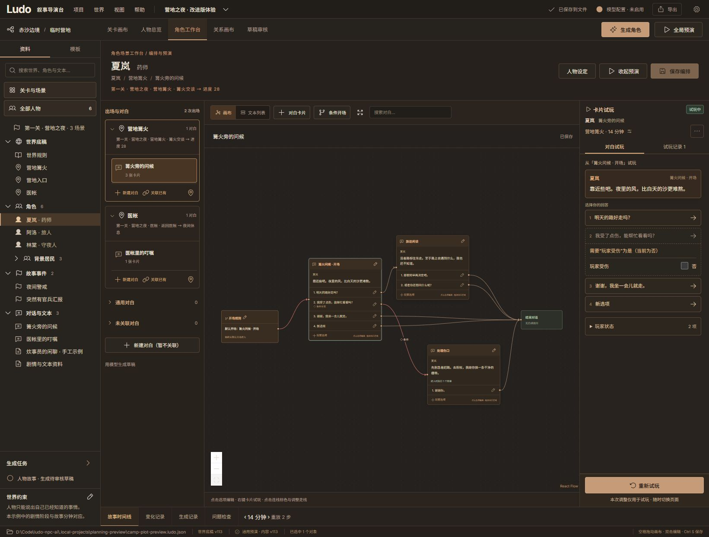

# 角色工作台：简化试玩与本地记录

2026-10-06。本轮集中改进角色工作台的试玩流程和历史记录入口，沿用暖灰、铜色界面。

## 使用方式

1. 选择人物、出场场景和对白，点击右侧「开始试玩」。默认从开场卡片开始。
2. 不可选的回答会显示原因；涉及玩家变量时，直接在回答下面调整状态。例如勾选「玩家受伤」，第二个选项立即可选，当前对白保持在开场。点击回答才进入「处理伤口」。
3. 需要换一条路径时点击「重新试玩」，保留用户调整的玩家设置，从起始卡片重新开始。
4. 在「试玩记录」中保存本次对白过程、查看历史记录，或使用原记录的玩家设置按当前剧情重新试玩。保存生成新记录，原记录不会被覆盖。

时间与场景在标题下折叠；其他相关变量在回答下方的「玩家状态」展开。调试信息、验证剧情入口和定位卡片集中在更多菜单。画布上右键对白卡片，可以从指定卡片开始试玩；卡片编辑面板也提供此操作。

## 两种测试范围

「卡片试玩」用于检查卡片及选项，起始卡片明确，不会因为调整玩家状态突然切换开场。它仅在本次测试中绕过条件开场分流，仍检查人物出场、卡片与选项条件，并执行对应效果。

「验证剧情入口」使用作者设定的开场规则，检查实际剧情应从哪张卡片进入。切换测试范围不会修改作者的对白入口配置。

调整变量使用有顺序的试玩操作：保留当前卡片和已点击路径，不重复执行当前卡片的进入效果。临时试玩允许直接切换页面；修改对白编排时，仍使用画布上方的保存、放弃、取消保护。

## 本地保存与历史兼容

新记录保存在工程 JSON 的 `editor.play_records`，包含记录名称、时间、内容版本、角色/对白/场景名称、初始变量标签与值，以及 NPC 台词、玩家回答和状态调整的快照。后续修改台词或移除引用对象，已保存快照仍可阅读。记录属于作者工具数据，不进入模型上下文或生成内容指纹。

记录列表右侧和详情页均提供删除按钮。删除后从常规列表移走，可以立即「撤销删除」，或进入「已删除」列表恢复；新旧记录都适用。删除标记写入工程的 `editor.deleted_play_records`，原对白快照和旧输入保留在本地，关闭再打开工程仍可恢复。旧记录同时从全局预演的已保存分支选择器隐藏。本版不提供永久清空。

旧 `simulation_cases` 继续出现在「试玩记录」，展示保存过的输入和操作路径。旧格式没有历史台词快照和保存时间，界面明确说明此限制，不能补造当时的对白。

重新试玩使用当前剧情和原记录的用户设置，清空原点击路径；不会把先前效果计算出的数值当成新的初始值，也不会改写旧记录。若来源对白已删除，仍可查看快照，但不能重新试玩。

## 验证

- Python 全量测试：198 项通过，覆盖条件、人物出场、进入效果不重复、失败跳转回滚、步数与操作上限、记录只追加、文件重开及 API 版本检查。
- 前端全量测试：71 项通过，覆盖变量操作顺序、重新试玩、复杂条件、旧记录展示及记录重开设置。
- Ruff、7 个生成契约/示例的一致性检查、生产构建通过。构建仍有既有的大文件体积提示。
- 浏览器验证：开场调整受伤状态后继续当前卡片、选择求助进入处理伤口、连续重复重开、从指定卡片试玩、临时试玩直接切换页面、保存记录后重新打开工程、查看新旧记录及用记录设置重新试玩。
- 保存验证使用本地工程副本，未往用户现有工程添加测试记录。当前本地体验入口为 `http://localhost:4184/`。

本轮未重新打包 Windows 分发程序，也未验证外部模型服务。全局预演的完整世界分支编辑保留现有功能；日常角色试玩使用本页简化流程。

删除功能补验：200 项 Python、72 项前端测试通过，Ruff、契约检查与构建通过。浏览器在工程副本验证新/旧记录删除、列表与详情页入口、立即撤销、刷新后恢复，测试结束恢复副本原记录。用户工程的历史记录未被测试删除。
