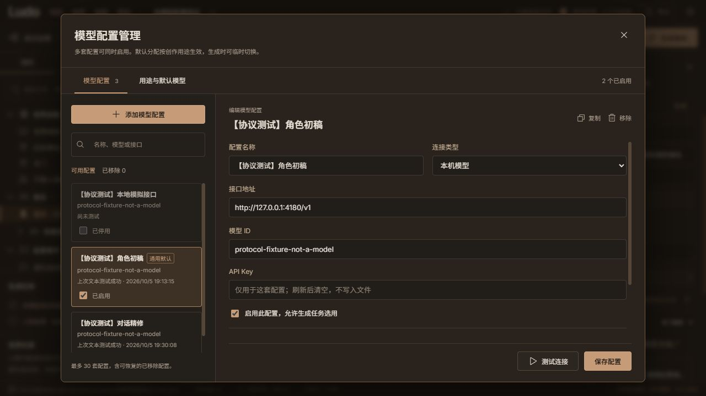
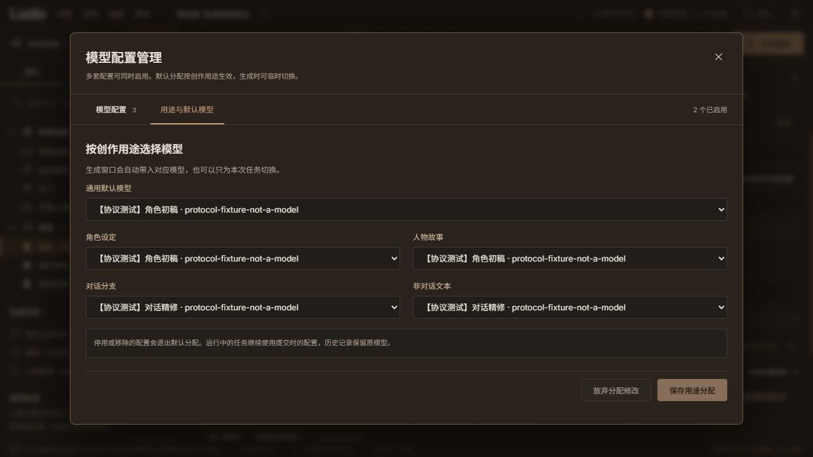
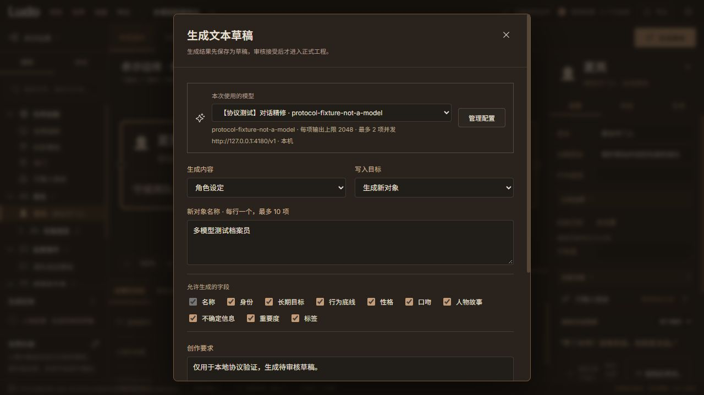

# 多模型配置管理

2026-10-05。本次在既有本地工程与生成审核流程上增加模型配置管理，维持暖灰铜色导演台设计。用户可以同时启用多套配置，按创作用途分配默认模型，每个生成任务明确使用一套配置。

## 操作与行为

- “模型设置”显示配置列表及独立编辑区，可按名称、模型 ID、接口地址搜索。支持添加、编辑、复制、启用与停用。新配置为空表单，复制保留请求参数并清空密钥与测试记录。
- “用途与默认模型”保存一个通用默认，以及角色设定、人物故事、对话分支、非对话文本四项用途默认。用途未指定时跟随通用默认。添加/复制/恢复配置不会抢占已有效的通用默认。
- 生成窗口展示本次实际选用的配置、模型 ID、接口及请求上限；默认按当前用途选用。手动选择后，在本次表单内切换用途仍保留手动选择。进入模型管理并返回会保留生成输入。
- 手动选中的配置若被停用/移除，窗口要求重新选择，不悄悄向另一接口提交。用途默认的停用项会退出分配；通用默认不可用时选用列表中首个仍启用配置，无启用项时不能生成。
- 移除有二次确认，然后进入“已移除”列表，可恢复同一 ID 和参数。移除清除该配置本页密钥，恢复不恢复密钥。移除项计入 30 套配置上限，本轮没有永久清空操作。
- 最近测试显示结果和时间，仅表示过去的一次小文本请求结果，不代表当前服务可用或结构化创作质量。改动接口、模型或请求参数后清空旧测试；未保存连接参数的测试不更新旧配置记录。
- 编辑配置或用途分配后，关闭/切换会提示先保存或放弃，避免直接丢失输入。编辑区可以滚动，桌面配置保存/测试按钮独立留在底部。

## 本地存储与任务溯源

配置和用途分配保存到本机应用配置目录的 `settings.json`；开发预览使用仓库 `.local-data/` 覆盖，正式默认仍为用户 AppData。项目保存在用户选定目录，不依赖外部存储。

每套配置的 API Key 独立留在页面内存。刷新页面后全部清空；不会保存到配置、工程、导出、备份或日志。配置复制与恢复不带回密钥。

新任务保存提交时的配置 ID、名称、模型 ID、无认证信息的接口地址及用途；之后改名、改变参数、停用或移除配置都不会改写历史。运行任务继续用提交时的参数快照；新任务按当前选择发起。旧配置默认启用，旧 v2 历史记录缺少新字段时照常读取。项目导出包含任务溯源，但不含可复用配置列表或密钥。

## 验证

| 验证 | 结果 |
| --- | --- |
| Python 回归 | 140 项通过；新增 12 项覆盖旧配置、独立参数、用途保存/清理、可恢复移除、无效默认、写失败不改内存/文件、测试记录来源、停用拒绝、运行/历史任务溯源与重启 |
| 前端/桥接/Sites | 20 项通过；包含用途默认、手动覆盖与停用后禁止静默回退 |
| 构建与契约 | Vite、Sites 兼容输出、Ruff 与格式检查、pip check、6 份契约/示例漂移检查通过 |
| Windows 程序包 | 已更新 `release/LudoNPC/`；[22 项多模型真实 HTTP](verification/model-config-package.json)，两个本机模型 ID 使用不同模拟密钥，错误密钥被拒绝、重启保留默认与历史 |
| 生成回归 | 更新程序包通过 [30 项既有生成 HTTP 检查](verification/model-config-generation-regression.json)，保留原第四批报告 |
| 浏览器 | [验证记录](verification/model-config-browser.json)：新增空表单、未保存保护、复制清空密钥、停用退出用途分配、可恢复移除、恢复/刷新后密钥空、用途自动选择、临时覆盖、从管理返回保留输入、待审核任务实际选用配置 |

本次全部使用本机协议模拟接口，无外部模型请求或费用。实际第三方兼容性与生成质量仍需用户有效连接验证。本轮实现多个配置与明确选用，尚无多个模型自动协作、优劣比较或失败自动换模型；密钥仍需每次页面会话输入。
