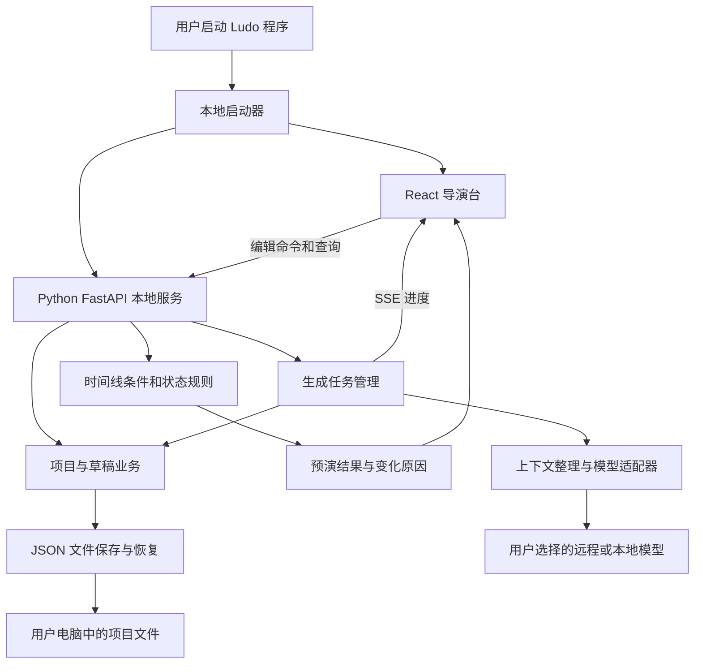

# Ludo NPC AI 产品模块技术架构与开发计划

本规划将现有导演台原型扩展为可长期使用的开源 NPC 文本创作工具。推荐采用现有 React 交互界面、Python 本地业务服务和本地 JSON 项目文件。用户下载程序后启动即可使用，无需账号、云数据库或外部存储。

优先完成“建立世界 → 组织角色 → 编排剧情与对话 → 生成草稿 → 审核 → 预演 → 保存与导出”的完整流程。生态扩展和大规模生成建立在可追溯的状态规则之上。

规划日期为 2026 年 10 月 5 日。批次 1–3 已完成数据底座、本地文件与界面接入、通用剧情与对话预演，见 [第三批交付](batch-3-delivery.md)。当前支持一次性规则、手动对话图、可保存分支，以及第四批模型任务和字段审核；真实服务商验收仍待有效连接。以下容量、工作量和未交付模块仍是规划目标；干净环境发行验收尚未完成。

## 产品定位与交付形态

主要用户是独立游戏作者、编剧、模组作者和需要大量人物文本的世界构筑者。成果包括角色卡、人物故事、人物关系、条件对话、非对话文本，以及可供游戏项目使用的结构化资料。

首版按 Windows 优先、单机单作者规划。前端保留暖灰铜色导演台：左侧资料库、中央拖拽画布、右侧属性与预演、底部时间线。用户可以离线创建、编辑、保存和预演项目；使用远程模型时需要联网，相关上下文会发给用户选择的模型服务商。软件自身不设云端内容仓库。

正式程序启动后，Python 服务监听本机回环地址并打开浏览器中的界面。关闭浏览器不会立即杀死写入或生成任务；启动器提供明确的退出方式，并提示尚未保存或仍在运行的工作。第一版保留一个后台进程，后续可加桌面窗口外壳。

交付分为开源源码和可直接运行的程序包。PyInstaller 可以把 Python 解释器与依赖一起打包，使用者无需安装 Python；不同平台需要分别构建。建议先做 Windows 文件夹式程序包，验证稳定后再考虑单文件启动器。[PyInstaller 官方说明](https://pyinstaller.org/en/stable/operating-mode.html)

## 模块与功能范围

表中的“MVP”指第一版可以分发给用户试用的完整产品目标，不代表现有原型已实现。

| 模块 | 负责的内容 | MVP 功能 | 后续扩展 |
| --- | --- | --- | --- |
| 项目工作台 | 管理一次世界或游戏的创作工程 | 新建、打开、另存为、最近项目、自动保存、备份恢复、项目校验 | 多项目模板、工程合并、跨项目素材复用 |
| 世界构筑 | 提供角色和剧情的共同约束 | 世界前提、风格、地理、地点、阵营、历史、命名规则、确认事实、秘密 | 自定义历法、世界资料批量导入、设定版本对比 |
| NPC 角色库 | 管理静态设定和人物故事 | 身份、目标、行为底线、性格、口吻、背景、秘密、已知与未知、重要度、标签、角色模板 | 人物弧线、多个故事阶段的设定、组合模板 |
| 关系画布 | 组织人物与故事对象 | 拖拽、缩放、框选、关系命名、分组、搜索定位、多个画布视图 | 自动布局、筛选子图、按区域或阵营聚焦、大图性能优化 |
| 剧情与时间线 | 定义发生顺序和影响 | 通用故事时钟、事件前置条件、事件结果、一次性触发、剧情分支、改期后重新计算 | 周期事件、区间事件、章节视图、跨故事线依赖 |
| 场景与行为 | 描述角色在特定环境里的表现 | 场景、时间段、角色位置、行为标签；按条件改变行为、文本与可见选项 | 日程、岗位替补、阵营政策、资源变化、区域生态 |
| 对话编排 | 管理交互选项和文本分支 | 对话节点、说话者、玩家选项、显示条件、选择效果、跳转与汇合、结束节点 | 子对话复用、参数文本、多语言、版本比较 |
| 非对话文本 | 承载游戏中的其他人物文本 | 信件、日记、传闻、人物小传、物品描述、任务说明；文本出现条件和作者归属 | 地区文本包、旁白、不同受众可见的版本 |
| 模型与生成 | 用第三方模型辅助创作 | 多连接档案、连接测试、能力检查、单角色与小批量生成、流式进度、取消、失败提示、用量记录 | 服务商适配器、局部重生成、模型对比、大批量任务 |
| 草稿与一致性 | 控制生成内容进入正式项目 | 草稿暂存、字段差异、逐项接受、已确认字段保护、引用检查、条件和认知检查 | 影响分析、审校规则包、可选模型复核 |
| 情境预演 | 验证文本在剧情中的实际表现 | 指定时间、场景、分支、玩家选择；查看角色状态、认知、可用文本、变化原因；回溯与重播 | 预演用例、覆盖率、多人关系变化、批量情境对比 |
| 输出与扩展 | 将创作结果交给游戏项目 | 完整项目 JSON、角色卡和文本文档、对话 JSON、CSV；导出格式版本说明 | Yarn 或 Ink 等专用转换器、引擎适配、插件协议 |

界面的连接线需要区分语义。普通人物关系表达“信任、雇佣、亲属”等设定；事件影响和对话跳转有明确的类型、条件和效果。普通关系线不会隐式变成剧情执行规则。

高级功能通过对象类型、视图切换和右侧面板逐步呈现。主画布集中展示当前创作范围，不要求把所有角色、对话和日程同时铺在一个页面上。

## 三条核心使用流程

### 从世界批量构筑人物

作者确认世界规则，选择区域、阵营和角色模板，填写人员构成与创作要求。系统先整理角色名单和职责分布，再生成角色设定、关系建议、人物故事及所需文本。作者在草稿面板查看重名、职责重复、认知越界和规则冲突，接受内容后加入正式角色库。

小批量生成先做名单与配额规划，再逐个或分组补充内容，避免每次请求都重新发送整份世界。MVP 先支持一个区域、约 5–10 个角色的批次；具体并发上限由连接档案和服务商限制决定。

### 从剧情事件构筑对话

作者创建“证据公开后，公会搜查诊所”的事件，选择影响人物并填写状态结果。系统根据人物在各阶段的目标与认知生成候选对白和玩家选项。作者审核条件、效果与跳转后，将其放入对话图；预演第 2 天、第 3 天和隐瞒证据分支，检查文本是否符合阶段。

### 在时间线中检查人物生态

作者指定时间、地点和剧情分支，查看角色在哪里、做什么、知道什么以及哪些文本可用。将事件提前、停用或改变条件后，系统重新预演并展示受影响的人物和文本。后续日程、阵营和资源规则使用同一套条件与效果机制。

这里的生态是创作工具中的可解释状态变化。例如老板被捕后酒馆改由店员经营、港口封锁后工人改变日程。它不承担游戏里的物理运动和持续运行的实时 AI。

## Python 与前端技术架构

推荐采用单体本地应用，业务模块在一个 Python 进程内协作。现有 React 画布继续保留，逐步迁移为 TypeScript 并拆分功能组件。Python 负责项目写入、规则计算、模型请求、草稿审核和导出。



| 层 | 建议技术 | 采用理由和边界 |
| --- | --- | --- |
| 导演台界面 | React、TypeScript、Vite、React Flow | 延续现有原型，承担画布和交互；不在前端再实现一套剧情规则 |
| 本地 API | Python、FastAPI、Uvicorn | 提供项目命令、查询、生成和预演；本地首版使用单进程，避免内存队列和项目写入被多个 worker 分割 |
| 数据模型 | Pydantic、JSON Schema | 校验项目、模型草稿与规则；生成前端类型所需的 schema，减少两端定义漂移 |
| 模型请求 | HTTPX AsyncClient、分协议适配器 | 复用连接、设置超时和流式请求；模型协议差异留在适配器内 |
| 生成任务 | asyncio 队列、受限并发、SSE | 适合本地单用户；任务结果与状态落盘，进度事件可重连查询 |
| 业务与预演 | 独立 Python 领域模块 | 规则计算可脱离界面测试；确定性状态变化不依赖模型调用 |
| 数据保存 | UTF-8 JSON、pathlib、临时文件与替换 | 无外部数据库；项目文件可读、可复制、可导入 |
| 验证 | pytest、规则回放用例、接口与浏览器流程验证 | 覆盖时间回溯、未知信息、格式迁移、写入失败和模型错误 |
| 分发 | PyInstaller、前端静态构建、本地启动器 | 面向用户打包运行环境；开发者仍可直接运行源码 |

FastAPI 提供单进程并发服务和 lifespan 启停机制；本方案据此管理队列、HTTP 客户端及退出收尾。Pydantic 的模型验证、序列化和 JSON Schema 用于数据边界。HTTPX 支持异步请求与流式响应，并建议复用客户端连接。这些库能力已对照官方文档，组合方式是本项目的架构建议。[FastAPI 进程说明](https://fastapi.tiangolo.com/deployment/concepts/)、[FastAPI lifespan](https://fastapi.tiangolo.com/advanced/events/)、[Pydantic 模型](https://docs.pydantic.dev/latest/concepts/models/)、[HTTPX 异步支持](https://www.python-httpx.org/async/)

MVP 不引入 Redis、Celery、云向量库或多服务部署。上下文首先通过实体引用、标签、场景和事实依赖筛选；确有搜索瓶颈后，再加入本地索引。

建议代码组织如下。现有前端仍在 `src/`，既有构建配套文件保留；Python 构建作为新增流程。

```text
ludo-npc-ai/
  src/
    features/          世界、角色、画布、对话、预演、任务界面
    api/               本地 API 客户端
    generated/         从 Python schema 生成的类型
  backend/
    pyproject.toml
    ludo_npc/
      api/             HTTP 接口和 SSE
      domain/          角色、事实、事件、条件、对话规则
      application/     编辑命令、生成与草稿提交
      storage/         JSON 仓库、备份、迁移
      providers/       模型协议适配和能力检测
      simulation/      时间推进、分支回放、解释日志
      export/          项目、文本和对话转换
    tests/
  desktop/             启动、退出与本地文件选择
  schemas/             项目格式、规则和导出协议
  docs/                产品规划与接口说明
```

业务接口围绕操作设计，例如“创建角色”“接受草稿字段”“修改事件”“预演到指定时间”。避免让前端每次把整份项目覆盖回后端。修改请求带项目修订号，后端拒绝过期修改并返回当前版本。

本地文件选择由 Python 启动器提供系统对话框，前端获得项目句柄后操作该工程；浏览器上传文件只作为导入入口，不假定能拿到任意本地绝对路径。本地 API 只监听回环地址，校验同源与本次启动的会话标识，文件操作限制在用户打开的工程及应用配置范围内。

## 本地数据存储方案

### 推荐首版使用单个项目 JSON

正式 MVP 默认保存为用户选择位置的 `项目名.ludo.json`，包含世界、人物、关系、对话、规则、草稿和预演用例。文件扩展名方便识别，内容仍是普通 JSON。项目不依赖浏览器缓存；浏览器站点数据清除后仍可重新打开该文件。

| 方式 | 优点 | 代价 | 建议 |
| --- | --- | --- | --- |
| 单个 JSON | 易理解、易复制、可直接查看内容，接近现有原型 | 文件变大后，完整校验和重写的成本上升 | 首版默认 |
| 项目目录中的多个 JSON | 可按角色或章节修改，便于 Git 审阅和较大项目组织 | 跨文件更新、引用、备份和搬迁更复杂 | 有实测容量需求后扩展 |
| 本地 SQLite 文件 | 事务、查询和增量更新方便，仍不需要外部数据库服务 | 文件不便文本比较，需要导出和格式迁移工具 | 保留为替代方案，不与 JSON 同时维护两份正式真值 |
| 浏览器存储 | 原型快速，适合界面偏好和可恢复缓存 | 受浏览器与站点数据生命周期影响，无法作为唯一项目备份 | 只保留辅助用途 |

SQLite 可以作为应用文件格式，也能使用自定义扩展名，因此“不要外部存储”不排斥它。当前更看重透明的工程格式和简单复制，建议先选 JSON，实测后再决定是否需要调整。[SQLite 应用文件格式说明](https://www.sqlite.org/appfileformat.html)

### 项目内容与应用配置分开

项目格式已升级为 schema version 2，通用数据校验与预演均不要求 `eve` 等示例 ID。

| 数据区域 | 主要内容 | 是否进入项目文件 |
| --- | --- | --- |
| 世界与实体 | 世界、区域、阵营、地点、角色、关系、模板实例 | 是 |
| 创作内容 | 对话图、非对话文本、事实、变量、规则、事件 | 是 |
| 生成记录 | 输入引用、模型标识、草稿、状态、用量与接受记录 | 是，但排除密钥和带认证的请求头 |
| 预演资料 | 初始状态、分支、用户选择、随机种子、预演用例 | 是；大型计算快照可重建 |
| 画布视图 | 节点位置、分组、画布名称、展示范围 | 是，与人物剧情状态分开 |
| 本机偏好 | 最近项目、窗口大小、连接档案、缓存索引 | 否，保存在应用配置目录 |
| API Key | 模型认证信息 | 否，默认仅保留在当前会话 |

结构概览如下；完整已实现协议见 `schemas/project-v2.schema.json`，此处省略部分字段。

```json
{
  "format": "ludo-npc-project",
  "schema_version": 2,
  "project_id": "稳定项目标识",
  "revision": 1,
  "content": {
    "world": {},
    "characters": [],
    "locations": [],
    "factions": [],
    "relations": [],
    "facts": [],
    "variables": [],
    "events": [],
    "rules": [],
    "dialogues": [],
    "texts": [],
    "drafts": [],
    "simulation_cases": [],
    "generation_history": []
  },
  "editor": { "canvases": [] },
  "metadata": { "created_at": "", "updated_at": "" }
}
```

所有实体使用稳定 ID，名称修改不改变引用。项目有整体修订号，内容与画布布局另记修订号；移动卡片不应使全部生成草稿失效。生成内容记录所依据的世界、角色和事实版本，用来识别过期草稿。

API Key 维持当前会话内存策略。后续若增加“记住密钥”，由用户主动选择系统凭据库；不可写入项目、导出、诊断包或普通配置 JSON。程序包内也不附带开发者密钥。

### 自动保存与恢复

编辑在界面即时反馈，后端按短暂防抖提交文件；拖动节点在操作结束时提交位置，模型流式片段不逐字保存整份项目。“已保存”只在后端完成写入后显示。

每次保存先序列化并校验，写入同目录临时文件并刷新，然后通过替换提交新版本。保留上一份有效备份，并提供按时间或手动命名的恢复点。写入失败保留原文件和未保存状态；文件锁、权限、磁盘不足与崩溃恢复需要实际测试，不能仅凭替换调用宣称完全无损。

项目布局示意：

```text
用户选定的目录/
  灯港.ludo.json             正式项目文件
  灯港.ludo.json.bak         上一份有效保存
  灯港.ludo.json.history/         有限数量的恢复点

应用本地配置目录/
  settings.json              偏好和连接档案，不含密钥
  cache/                     可重新生成的索引与状态快照
  logs/                      有容量限制、已去除认证信息的日志
```

正常保存完成后，复制主项目 JSON 就能迁移核心文本工程；备份和历史是可选恢复资料。未来引入附件时再提供 `.ludo` 项目包，包内包含 JSON 和附件，而不是把 ZIP 包当作高频自动保存的工作文件。

同一项目暂只允许一个进程写入。多个窗口修改时检查修订号；外部修改触发冲突提示，提供重载、另存副本或比较，避免静默覆盖。项目格式迁移前保留原文件，无法识别的新版本拒绝覆盖。

## 角色剧情与对话的数据规则

需要把三种数据分清：作者定义的人物设定、故事中的客观事实、某个情境下人物的认知和行为。模型生成的故事文字不能直接替代这些结构化数据。

| 对象 | 关键字段 | 设计要求 |
| --- | --- | --- |
| 角色定义 | 身份、目标、底线、口吻、背景、确认字段 | 稳定设定与阶段状态分开 |
| 世界事实 | 内容、真假、有效时间、来源、可见范围 | 作者知道的秘密不等于所有人物都知道 |
| 人物认知 | 事实 ID、获知时间、渠道、确信程度 | 支持未知和错误认知，明确何时获知 |
| 剧情事件 | 计划时间、前置条件、优先级、对象、效果 | 先满足条件，再改变状态；改期后可重算 |
| 条件规则 | 条件组、目标、效果、重复策略 | 可视化编辑，采用受限规则结构，禁止执行任意 Python 表达式 |
| 对话图 | 节点、说话者、文本、选项、条件、效果、目标节点 | 有效引用、合法汇合和结束路径；允许有意循环，但预演有步数限制 |
| 非对话文本 | 文本类型、作者、读者、出现条件、关联对象 | 适用范围和可见条件可验证 |
| 预演分支 | 初始状态、事件与选择记录、故事时间、种子 | 从确定的初始状态回放，不直接修改作者设定 |

MVP 条件先覆盖布尔变量、数值比较、场景与时间、事件是否发生、人物是否知道某事实；效果先覆盖设置变量、数值增减、授予认知、改变位置或行为、解锁文本。

时间使用可排序的故事时间值，界面再映射为天、时段或章节标签，不再限制为五天。对于相同时间的事件，规定稳定的执行顺序；一次性与重复事件有不同的触发标识。限制连锁触发步数，报告循环影响，避免规则互相触发而无法结束。

回溯从初始状态或兼容快照重放事件。信任增减、承诺和认知都记录发生时间，避免把未来的信任值带回过去。相同项目版本、初始条件、选择记录和种子应得到相同的预演结果；模型不参与这一步计算。

作者修改世界规则或剧情事件后，相关预演缓存失效，系统提示需要更新的文本或草稿。首版采用明确的实体与事实引用追踪依赖，后续再细化局部失效范围。

## 模型生成与草稿审核

模型连接档案包含服务类型、接口地址、模型名、能力、超时和用量设置。提供自定义接口和多个档案；首批实现一种常见兼容协议，通过连接测试检查能力，其他协议后续独立适配。不能因为地址兼容就假定所有服务支持结构化输出、流式响应和取消。

生成流程采用可观察的步骤：

1. 作者选择目标、模板、时间或场景，以及允许生成和修改的字段。
2. 按目标整理世界约束、相关角色、关系、已知事实和任务目标，记录所依据的版本。
3. 在可配置并发与预算内请求模型，显示进度和错误；不把整份项目默认为每次请求的上下文。
4. 校验输出结构，再检查引用、认知条件、锁定字段和明显规则冲突。确定性检查与模型复核分别标注，不能承诺所有故事矛盾都能自动发现。
5. 保存候选草稿，展示逐字段差异和检查结果。格式错误只在限额内修复，超出后由用户处理。
6. 用户逐项接受或整份接受，后端按当前项目版本提交修改；过期草稿先重新比较，不能覆盖后来的人工作品。

任务包含 queued、running、awaiting_review、applied、failed、cancelled、interrupted 等明确状态。应用重启后，未完成请求标为中断，不自动再次调用收费模型。取消应停止继续排队及本地请求，但服务商已经开始的处理或费用不能保证撤销。

批量任务保存每个对象的成功、失败、草稿和上下文版本。重试只处理需要重试的对象；采用服务商错误分类和有限重试，生成修复调用同样计入预算。用量来自实际响应，响应未返回的部分不冒充准确费用。

## 开发阶段与验收

现有页面已从阶段 0 原型接入本地工程、通用剧情预演和模型任务/字段审核。后续沿用选定设计，不另起一套页面样式。

工作量按一名熟悉项目的开发者集中开发估算，不是交付日期，也不包含大量新增需求和多平台发行。允许实现中根据首轮数据模型和打包验证调整。

| 阶段 | 工作重点 | 可检查的交付和验收 | 参考工作量 |
| --- | --- | --- | --- |
| 0 视觉原型 | 视觉、卡片、示例联动和模拟审核 | 已完成，界面持续沿用；当前执行已迁入 Python | 已完成原型 |
| 1 数据与本地服务 | Python 项目骨架、schema v2、项目命令、JSON 保存、恢复、前端 API 接入 | 任意新项目可创建；原型 v1 可迁移；重启可打开文件；清除浏览器数据不影响工程；写入失败不覆盖原文件；早期程序包能启动 | 3–5 工作日 |
| 2 通用剧情与对话 | 移除示例 ID 限制；条件、效果、事实、通用时钟、对话图和预演日志 | 至少两个不同世界都能手动编排；场景、日期、分支改变状态和文本；回溯不泄漏未来认知/信任；错误引用和连锁循环可定位 | 7–12 工作日 |
| 3 真实生成与审核 | 模型档案、协议适配、上下文整理、角色/对话/非对话文本生成、小批量任务、差异审核 | 使用测试模型适配器验证错误与恢复；有有效连接时完成真实生成；5–10 个角色批次可逐项审核；确认字段受保护；过期草稿不会静默覆盖 | 7–12 工作日 |
| 4 可分发 MVP | 稳定 Windows 程序包、基本导出、撤销与恢复、任务中断处理、性能检查、使用文档与开源规范 | 干净测试环境中无需安装 Python/Node；启动→新建→生成→审核→预演→保存→重新打开→导出完整通过；确定开源许可证并提供源码与示例 | 5–8 工作日 |
| 5 生态与规模扩展 | 日程、区域/阵营/资源变化、群体关系、较大批次、局部生成、影响分析、专用导出和跨平台 | 用具名场景验证酒馆换班、港口封锁、阵营政策变化等；较大工程实测后决定 JSON 分拆或本地索引；引擎适配分别验收 | 10–20 工作日，需拆分子版本 |

第一版可分发 MVP 的参考量级为阶段 1–4 合计 22–37 个集中工作日。最优先的完整链路是“世界 → 人物 → 事件 → 条件对话 → 生成审核 → 预演 → 本地文件”；不以功能数量替代这条链路的可靠性。

MVP 数据验证先使用约 100 个角色、1000 个对话节点、100 个剧情事件作为目标样本，检查打开、保存、查询、预演和画布聚焦。该规模是测试目标，尚不是已证明的容量上限。1000 角色以上的项目另设性能样本，依据测量再调整文件粒度和展示范围。

必须长期保留的用例包括：不知道某事实的角色不能提前使用该事实；同一事件不会重复加数值；改变事件日期会同步改变结果；不同分支互不污染；未接受草稿不进入正式内容；升级失败保留旧文件；磁盘写入失败和异常退出可以恢复；导出不含密钥；模型任务错误不会丢失已经接受的人工作品。

## 第一版范围与后续决策

第一版包含本地工程、世界资料、角色卡、关系画布、通用条件事件、对话图、非对话文本、真实模型生成、草稿审核、预演、基本导出及 Windows 程序包。

多人实时协作、云同步、模型市场、游戏内运行时接管、角色模型生成、完整经济模拟和所有引擎导出不列入第一版。可以在已有模块边界上扩展，但不提前为它们增加外部服务依赖。

建议采用以下开发基线：Windows 优先；Python 单进程本地服务；保留 React 导演台；项目 JSON 为唯一正式数据来源；规则先通用化，再接模型；所有生成先进入草稿。用户已确定 Python 和无需外部存储，其余是本规划提出的默认选择。

阶段 1 的数据定义、项目命令、迁移和 API 骨架已在批次 1 交付；批次 2 完成文件保存、恢复、界面接入和早期 Windows 打包启动验证；批次 3 完成阶段 2 的一次性条件执行、手动对话图、场景/选择记录、回溯和日志，并验证灯港与独立驿站。系统选择器代码与运行库已接入，完整选择/取消交互和干净环境发行验收仍待补验。周期日程、完整生态和大规模性能留在后续阶段；阶段 3 已接入结构化草稿与通用条件，协议由本机夹具验证，真实服务商尚待补验。正式发布前再确定许可证、服务商首批适配和公开发行范围。

## 具体推进批次

按小批次交付，每批给出变更、验证结果、可体验入口和剩余边界。先完成各模块共享的数据和本地保存，再扩展剧情与生成。现有界面作为持续体验入口，页面风格保持已选定方案。

| 批次 | 对应阶段 | 开发内容 | 本批完成的判断依据 |
| --- | --- | --- | --- |
| 1 数据定义与 Python 骨架 | 阶段 1 | 建立后端目录、schema v2、实体 ID 与引用、编辑命令、项目修订号；区分作者设定、预演状态、草稿与画布布局；准备空白项目和灯港迁移样例 | 不依赖内置角色 ID 的项目可校验；v1 示例可迁移；非法引用、版本和字段冲突可被识别 |
| 2 本地文件与界面接入 | 阶段 1 | 新建、打开、保存、另存为、自动保存、备份恢复；系统文件选择；现有画布和属性面板接入 Python；初步打包验证 | 新建工程→编辑卡片→保存至选定文件夹→关闭→重新打开，内容和布局一致；清除浏览器数据不影响已保存工程 |
| 3 通用剧情与对话预演 | 阶段 2 | 条件、效果、人物认知、通用时间、事件执行、对话节点和选项；回溯与变化解释 | 至少两个世界的自定义角色均可参与；日期、场景和选择改变对白；不同分支不污染；回溯不会提前获得知识或信任 |
| 4 模型生成与草稿审核 | 阶段 3 | 连接档案、模型适配、上下文组装、角色/故事/对话生成；字段差异、审核、小批次任务和取消 | 接入有效模型后完成真实生成；未接受内容不进入正式设定；已确认字段受保护；错误和中断可解释、可处理 |
| 5 可分发 MVP | 阶段 4 | 撤销与恢复、导出、任务容错、容量测试、Windows 程序包、说明与许可证 | 在干净环境完整体验创建、生成、审核、预演、保存、重新打开和导出；可直接运行程序包 |
| 6 生态与规模扩展 | 阶段 5 | 日程、阵营/区域影响、群体行为、较大批量和专用导出 | 使用酒馆换班、港口封锁等明确场景验收；容量扩展以测量结果为依据 |

批次 1–3 已交付，详见 [第三批交付](batch-3-delivery.md)。批次 4 的软件接入已完成：连接测试、chat/completions 协议、上下文整理、角色/对话/非对话文本候选、字段审核、确认保护、小批次任务和取消，详见 [第四批交付](batch-4-delivery.md)。使用本机协议夹具完成实际 HTTP 和 Windows 包流程检查；尚未调用外部真实模型，阶段 3 的服务商兼容性与生成质量验收仍待有效连接补验。下一步进入批次 5 的可分发 MVP 整理，并保留这项验收缺口。

开发过程中保持一个端到端样例，每批扩展它，并加入一个不依赖灯港人物的独立世界验证通用性。对于模型调用或操作系统文件行为，记录实际验证环境和仍未覆盖的部分，不把模拟结果标成正式能力。
