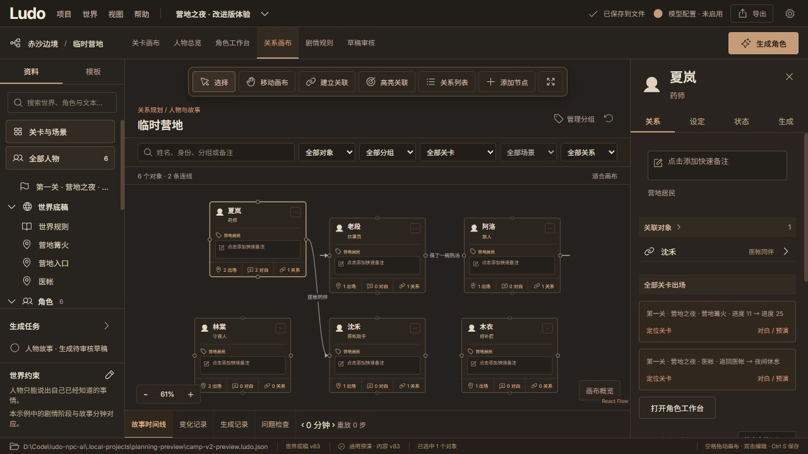

# 关系画布改进 · 2026-10-06

本版落实人物卡片、快速备注、按钮关联高亮、画布筛选、分组入口和关系列表。沿用暖灰/铜色导演台；人物总览、关系画布、出场与对白引用同一人物 ID。

## 卡片与快速备注

- 人物卡片显示姓名与身份，隐藏角色等级/重要性文字；既有 importance 数据和人物总览筛选保留。
- 分组标签可以打开归属管理。卡片右上角更多按钮与右键菜单提供设定、高亮、分组、出场、对白、关系列表、建立关系和移出画布。
- 快速备注在人物总览、关系画布与属性栏共用 `editor.character_notes[character_id]`，最多 3000 字符。点击备注打开独立编辑窗口，可保存、取消、留空清除；长备注默认显示两行，完整内容可在编辑器查看。新旧项目默认空备注。
- 备注属于作者注释，只增加 layout_revision，不改变人物故事、目标、预演状态、生成上下文或草稿依据指纹。命令 `set_character_note` 支持 expected_note；遇到并发备注改动拒绝覆盖。删除人物时清理对应注释，非法引用整批拒绝。
- 出场、对白和关系统计是三个独立按钮；多次出场先展示列表再定位。低于 55% 缩放时收起正文，保留身份与统计；正常缩放恢复备注和标签。

## 画布整理与联动

- 选中人物保持正常显示。顶部“高亮关联”按钮或卡片菜单显式开启/关闭高亮；开启后突出本人、直接邻居和本人关联连线，其他对象淡化。切换人物更新范围；选择非人物取消高亮。
- 搜索覆盖姓名、身份、分组、备注。可组合对象类型、人物分组、关卡、场景、关系类别筛选；只展示两端可见的连线。关卡/场景筛选来自出场安排，不定义关系生效范围。清除筛选和适合画布独立操作，筛选与高亮不写入项目。
- 分组支持现有归属管理、移动、统一重命名/合并/解散和本次画布的 20 步撤销，复用原有原子命令与冲突保护。
- “添加节点”区分引用尚未显示的已有对象和新建故事对象。移出画布只修改布局 visible，保留对象和关系；添加引用恢复位置与档案。关系列表可定位未显示的关系端点并放回画布。
- 属性栏默认关系页，展示备注、分组、直接关联对象和全部关卡出场。窄屏单击人物不自动弹出遮挡画布的属性栏，更多菜单的设定入口仍可打开。
- 关系画布默认使用紧凑底部故事时间栏，其他记录页仍可展开。概览图按按钮展开，避免默认遮挡人物卡片。

## 关系管理

- 支持来源对象、目标对象、名称、人物/故事/对白类别、单向/双向方向、独立说明。双向关系两端有箭头；没有模拟效果，只描述作者规划。
- 点击连线或从关系列表进入编辑。顶部建立关联支持表单选择对象，连接点拖拽仍可使用；拖拽产生的句柄布局写入当前已保存画布，保留刚完成的位置修改。
- 关系列表提供项目全局搜索、类别筛选、仅当前人物、编辑与定位，包含未显示节点的关系。既有关系删除入口保留，本地文件备份可恢复。
- 旧 v2 文件的关系默认单向、空说明；这些默认值不会使已有草稿指纹变化，也不产生隐式编辑。新字段和命令已同步 JSON Schema、OpenAPI 和 v2 示例。

## 验证与范围

167 项 Python 测试、32 项前端/桥接/Sites 检查通过；构建、7 个生成合同/示例漂移检查、Ruff 与差异格式检查通过。新增测试涵盖注释与模型/模拟隔离、并发冲突、非法引用/长度的原子拒绝、删除清理、实际文件重开、关系元数据、旧文件兼容、直接邻居与组合筛选。

实际页面验证：两处备注编辑同步、刷新恢复、取消与清除；高亮默认关闭、按钮开关、选中人物跟随；备注搜索、关卡/场景/类别/分组筛选；关系创建、空白名称校验、双向箭头和说明持久化、列表搜索与编辑；分组保存/撤销；移出/恢复引用；定位关卡和对白入口；键盘/右键菜单及 Esc 焦点恢复；740×800 卡片与编辑窗口。页面控制台未见错误或警告。临时测试备注、分组和关系已恢复，预览的全部 content 与 editor 均与规范化测试基线一致。

高亮与窄屏演示截图含临时备注，已从工程清理：`screenshots/relationship-highlight.png`、`screenshots/relationship-narrow.png`。本次只更新 localhost:4184 预览，没有重新打包 Windows 程序、推送远程或调用外部模型。大量节点性能和完整辅助技术兼容性未验证。

多选对齐、自动排布预览/撤销、折叠整理区、多关系画布及剧情条件驱动的关系变化继续按后续阶段推进。
