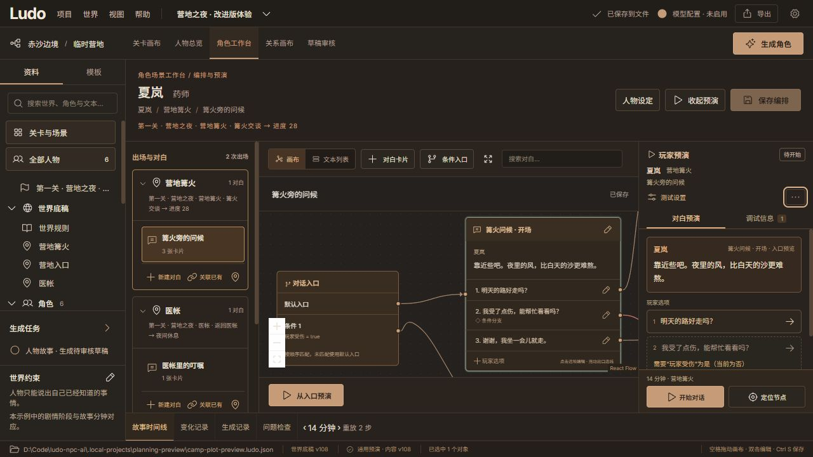

# 角色工作台：玩家预演面板优化

本页记录预演面板初版交付。测试设置现已改为先调整再显式应用，开场规则和离开保护见 [预演流程优化](preview-flow-delivery.md)。

角色工作台右侧默认只展示当前角色、出场场景、所选对白、运行状态、NPC 文本和玩家选项。对白由左侧场景资料库选择，移除右侧重复的对话图下拉框。

- “测试设置”按需展开故事时间、当前测试场景、初始变量和已保存分支。更改初始变量仍会重放整个分支，历史选择可能因此失效。
- “更多”收纳保存预演分支、从这里分叉、放弃预演输入；支持点击外部或 Esc 收起。
- “对白预演 / 调试信息”在同一面板内切换。调试页先展示重放问题、未满足条件，再展示折叠的已通过检查、重放变化、人物认知和执行记录。重放变化包括当前时间前的事件、规则和对话效果，并非只指最后一次点击。
- 不可选项展示简短的条件原因，完整比较与条件树在调试页查看。取反与任一条件的解释保留逻辑语义。
- 开始／重新开始、定位节点固定在底部；只滚动中间内容。定位保持画布缩放比例，不移动节点或修改编排。文本列表模式需先切回画布才能定位。
- 未保存编排在面板内提示并提供保存入口，阻止通过此面板启动或选择过期对白。现有画布保存／放弃和页面切换保护保留。

## 验证

- `node --test tests/*.test.mjs`：63 项通过，新增 4 项覆盖条件解释、逻辑分支、未保存／不完整状态和结束后的重开权限。
- `npm run build`：通过，已有大包大小提示仍存在。
- 独立浏览器标签验证：开始、选项跳转、结束、重开；测试变量切换条件入口；分支输入放弃；未保存编排提示和按钮保护；键盘切换页签；更多菜单及 Esc 收起。
- 定位前后缩放均为 `0.874101`，仅视口平移改变。浏览器控制台无 error/warn。
- 使用本地体验工程进行临时预演，未保存测试分支或测试编排，项目内容版本保持 108。
- 本次仅改前端展示和面板交互，Python 模拟、工程 JSON 契约和模型调用未改动。

截图：
