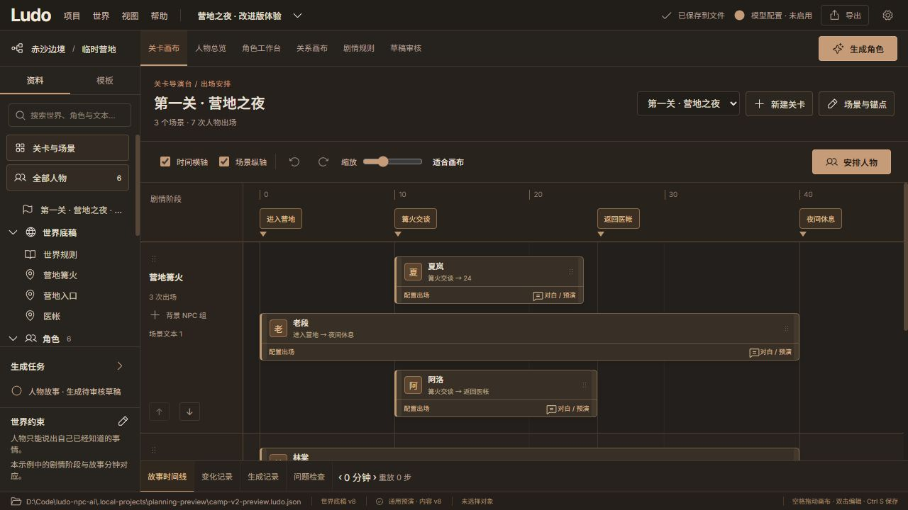
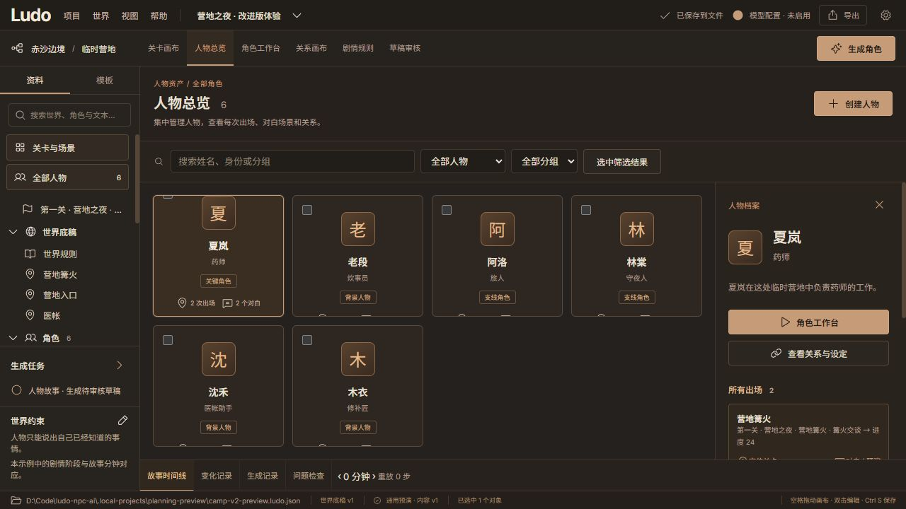
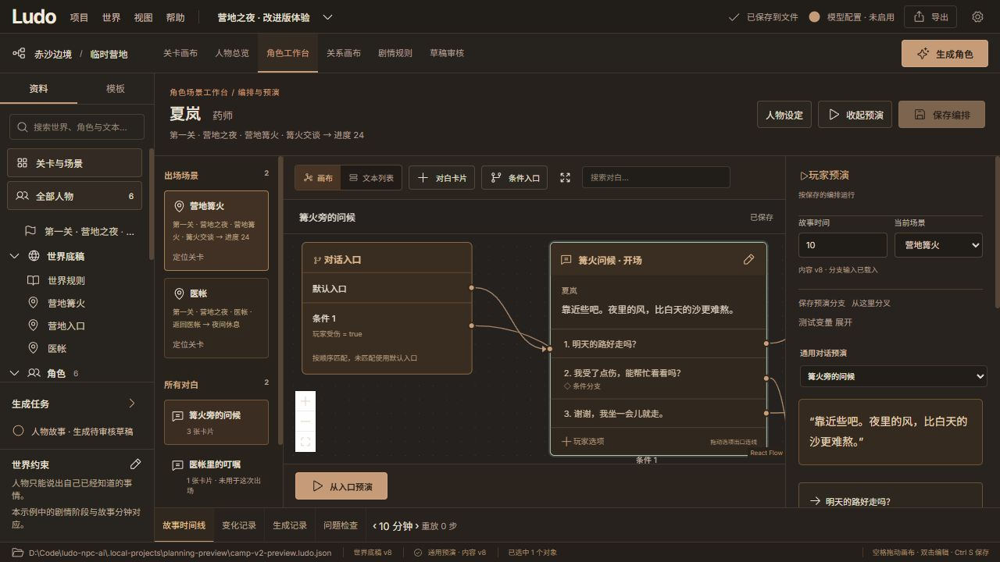
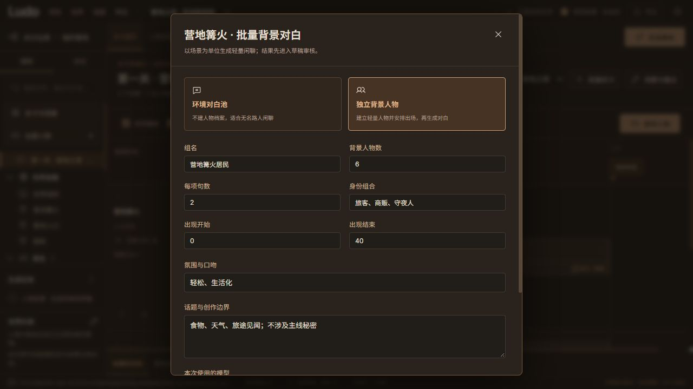

# 场景导演台 · 第一版改进

本轮围绕游戏作者的工作顺序组织页面：搭关卡场景 → 安排人物出场 → 编排这个人物的对白 → 在旁边模拟玩家选择。既有世界观、关系、模型配置、草稿审核和本地 JSON 工程继续使用。

## 页面与操作

| 页面 | 本轮实现 |
| --- | --- |
| 关卡画布 | 多关卡；时间/剧情阶段横轴、场景纵轴开关；添加、编辑、删除锚点和场景；左右拖动时间锚点、绑定端点跟随；场景拖动排序及上下按钮；资料库拖入人物；出场片段平移、两端调整范围；缩放、滚动、适合画布；最近 30 次关卡安排撤销/重做 |
| 人物总览 | 所有人物小卡片，搜索、重要程度/未安排/无对白筛选、标签分组；批量加组和安排出场；单个人物所有出场、对白数量、设定和关系；直接定位关卡、进入工作台或关系画布 |
| 角色工作台 | 同一人物所有出场场景和对白列表；对白卡片、玩家选项出口、默认入口、按顺序匹配的条件入口、连线和结束点；卡片内按钮打开条件/效果/跳转编辑；自动整理、节点搜索、文本列表；保存编排后预演 |
| 玩家预演 | 与对白画布并排；切换故事时间/场景、测试变量、选择回复；显示条件原因、访问路径和状态变化；保存分支、分叉、放弃输入；放弃临时输入恢复选中的场景上下文 |
| 场景背景对白 | 在场景轨道点击“背景 NPC 组”；环境对白池不建人物档案；独立人物模式建立轻量档案和出场安排，再生成各人的短对白；指定数量、身份、氛围、话题、时间范围和本次模型；生成结果进入原有草稿审核 |

## 数据与执行

人物主档案只有一份。`content.levels` 保存关卡、锚点、场景轨道和多次出场引用；每次出场保存人物、轨道、开始/结束位置、可选锚点绑定、条件、行为说明和指定对白。人物总览、关系画布、关卡和工作台读取同一批引用。

对白布局保存到 `editor.dialogue_layouts`，不会让内容草稿因单纯移动卡片而过期。新增命令沿用原子事务、引用校验、版本冲突和自动保存。删除锚点保留原时间、解除绑定；删除轨道把相关出场放到“待安排”，保留人物和对白。被已保存预演分支引用的关卡不能直接删除。

带 `level_id` 的预演会检查人物的出场时间、当前场景、出场条件和指定对白。服务器在执行玩家选择及效果前再次检查，不能通过直接提交请求跳过出场限制。通用预演仍可不指定关卡，保持旧工程行为。时间范围包含起止位置。

批量生成请求携带场景和时间上下文，适配器对输出追加场景/时间条件。审核时仍需检查并接受这些条件；作者主动只接受正文、舍弃条件或之后修改条件，会改变文本的使用范围。世界事实、角色认知和自然语言创作质量仍由作者审核。

旧 v2 文件缺少新字段时默认载入空关卡和空对白布局。新数据继续保存在用户选定的 `.ludo.json` 中，配置仍在本机应用目录，API Key 仍只在页面会话和正在运行的请求内存中。

## 验证

| 检查 | 结果 |
| --- | --- |
| Python | 156 项回归通过；新增 16 项覆盖旧合同默认值、共享人物多次出场、无效引用和范围的原子拒绝、服务器出场门禁、布局与内容版本隔离、保存分支引用保护、两类场景生成与审核后保存重开、营地模板预演 |
| 前端/桥接/Sites | 24 项通过；含 4 项关卡纯逻辑测试，覆盖锚点跟随、解绑保留、重新安排、重复出场索引 |
| 构建/合同 | Vite、Sites 输出、Ruff 检查及后端格式检查通过；7 份合同/示例漂移检查通过 |
| Windows 程序包 | [16 项既有文件/静态资源真实 HTTP 检查](verification/director-base-package.json)和[8 项新版关卡 HTTP 检查](verification/director-package.json)通过；新版保存在 `release/director-v1/LudoNPC/` |
| 实际页面 | 在独立营地文件中验证人物总览、篝火/医帐不同对白、卡片标题编辑保存与刷新、受伤条件入口、节点效果信任 0→1、记录展开、放弃输入恢复时间 10、锚点微调、出场拖动 10–24→12–26、撤销恢复、场景排序、两种批量配置；740×800 窄屏检查后恢复默认视口 |

“营地之夜”是新增的手工示例，含 6 个人物、3 个场景、7 次出场、2 个对白图和 1 份环境闲聊。没有调用外部模型；批量请求传输、结构化校验、审核与持久化由本机协议夹具测试覆盖，真实服务商兼容性及输出质量尚未验证。

原程序目录在运行中，本轮新包使用独立输出目录，打包脚本增加输出目录校验和启动文件锁检查。保留整个 `LudoNPC` 文件夹。干净 Windows 环境、端口冲突与正式发行体验仍待验证。

## 第一版边界

- 剧情阶段是故事时钟上的整数位置；还没有独立于世界时钟的相对关卡计时或重复日程。
- 行为说明用于规划；修改人物运行位置/行为仍由显式剧情规则或对白效果执行，不会自动模拟生态。
- 条件分支使用条件入口和玩家选项配置，没有额外的任意脚本、等待、并行流程节点。
- 关卡撤销是本次打开画布的局部历史；其他编辑仍用保存/放弃及本地备份恢复。横纵轴开关和缩放是临时视图状态。
- 每批生成 1–10 项、全局最多 2 项并发。独立人物模式先保存人工填写的轻量人物和出场，模型失败也会保留它们；只有生成的对白需审核。尚未实现大规模群体去重、口吻评分或自动多模型协作。
- 桌面是主要使用场景；对白长文保留文本列表，窄屏工作台上下堆叠。大工程容量和复杂对白布局仍需专门测试。

## 画布标题直接编辑

时间/阶段锚点和场景轨道标题支持双击或 F2 就地改名；Enter 或勾选按钮保存，Esc 或取消按钮放弃。名称不能为空，最长 150 字符。正在编辑时保护工作区切换与页面关闭，保存失败保留输入供重试。

原“场景与锚点”窗口保留，两处修改同一份关卡数据，出场卡片的阶段名称同步更新。只修改标题，保留锚点时刻、场景地点引用、人物出场与端点绑定；改名进入画布撤销历史。

本次已通过构建、4 项 Sites 检查与浏览器验证：横纵轴双击、F2、保存/取消、空名称拒绝、双向配置同步、导航保护、撤销和刷新。测试名称已恢复，保存文件的关卡与世界地点内容与测试前一致，浏览器未记录警告或错误。本次改动已更新 localhost:4184 预览，独立 Windows 程序包尚未重新打包。

## 轴节点右键操作与追加

- 去除轴标题上的常驻铅笔，保留双击/F2 直接改名；右键或 Shift+F10 打开节点菜单。菜单可编辑、删除、标记 7 种颜色与 8 种图标选项，场景还支持上下移动。Esc 关闭并返回节点焦点，点击其他位置或滚动画布关闭菜单。菜单自动限制在窗口边界内。
- 横轴末端提供追加时间锚点入口，在数字刻度行保持可见，避免遮挡拖拽标签；默认时间为最后锚点之后 5 个时钟单位，可立即输入名称、时间和标记。纵轴底部直接追加场景，可关联已有地点或创建新地点；同名地点复用。保存后定位新增节点。
- 原配置窗口保留，同步编辑名称、时间、场景地点、颜色和图标。删除锚点解除端点绑定并保留时间，删除场景把已有出场移入待安排轨道。上述操作支持本次画布撤销。
- 颜色/图标是本地 JSON 的严格枚举字段，旧节点默认无图标/默认颜色；不产生故事效果。视觉标记不改变生成依据指纹，避免使旧草稿过期，时间及故事编辑仍会改变指纹。

验证：161 项 Python 回归通过（新增旧合同默认值、非法标记原子拒绝、实际文件保存重开、故事状态和绑定保持、草稿指纹兼容测试）；21 项前端/桥接/Sites 检查通过；构建、合同漂移、Ruff 检查通过。首次 Python 测试结束时遇到系统临时目录清理权限限制，改用工作区内新的测试目录后全套退出成功。真实页面验证了横纵轴菜单、标记保存与刷新、右键编辑时间与端点跟随、删除保留出场及撤销、两种追加、同名地点复用、配置窗口双向同步、键盘菜单/取消与 740×800 边界显示。测试后关卡、标记、世界地点与测试前一致。

预览已更新到 localhost:4184。此次未重新打包 Windows 程序或推送远程。截图见 `docs/screenshots/axis-context-menu.png` 和 `docs/screenshots/axis-menu-narrow.png`。

## 人物分组管理

人物总览增加卡片右键/Shift+F10 菜单和卡片右上角标签按钮、人物详情入口、批量管理入口，以及顶部“管理全部分组”。

- 单人/批量管理：勾选加入、取消移出，可输入新分组名称。批量复选框显示部分所属状态，只有明确操作过的分组才改动；未触碰的归属逐人保留。
- 移动：选定原分组与目标分组，只替换属于原分组的所选人物；其他组不变，重复目标归属合并。目标支持已有分组或新名称。
- 统一管理：显示分组人数与成员，统一重命名；同名目标提示合并。解散仅移除该项归属，人物、其他分组、关系与出场保留。筛选名称随重命名更新，分组消失时回到全部。
- 撤销：保留本次打开人物总览最近 20 次分组修改，仅还原被修改的人物标签；如成员已被其他操作改变，拒绝直接覆盖。刷新或离开人物总览后局部撤销历史清空，数据本身已自动保存。

分组沿用人物 tags，兼容旧文件与背景 NPC 生成，不创建独立空分组目录。每个人物最多 100 个分组，名称 1–150 字符；沿用原子命令上限，单次最多修改 500 人，超限整批拒绝，不做部分保存。未点击保存的新分组只属于窗口草稿；取消即放弃。

验证：27 项前端/桥接/Sites 检查通过，新增 6 项分组逻辑回归覆盖部分修改、移动保留其他组、重命名合并、解散、撤销冲突和批次限额。构建与差异格式检查通过。实际页面验证了单人加入/移出、批量部分所属、移动、统一重命名、同名合并、解散、撤销、右键和键盘入口、保存刷新以及 740×800 窄屏。测试临时分组已恢复，工程全部 content 与测试前一致。本次仅更新 localhost:4184 预览，未重新打包 Windows 程序或推送远程。
